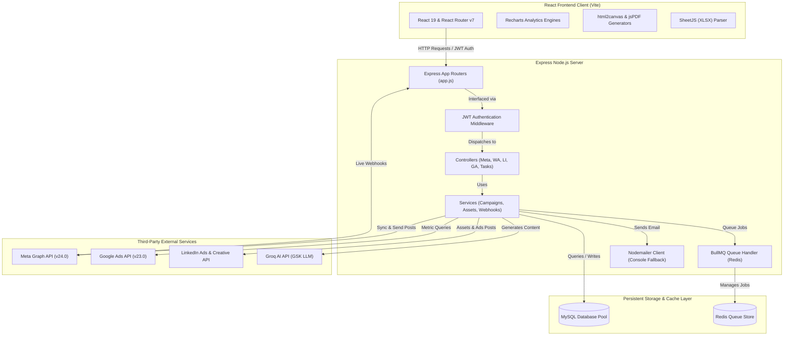

# White Force Ad Management: Unified Ad & Message Operations Hub

White Force Ad Management Hub is an enterprise-grade multi-platform integration dashboard designed to centralize and automate marketing operations across **Meta (Facebook/Instagram) Ads & Lead Forms**, **Google Ads & YouTube Campaigns**, **LinkedIn Ads**, and **Meta WhatsApp Business Cloud API**. 

The ecosystem provides robust user roles, hierarchical permissions, synchronous/asynchronous queue-based campaigning, automated CRM directory segmentation, direct ad-generation wizards, central media asset management, and advanced analytics.

---

## 1. System Architecture & Technical Stack

The platform is designed around a decoupled client-server architecture. Below is a high-level visual representation of how the components, databases, and third-party APIs connect:



### Backend (Server) Tech Stack
* **Framework:** Express.js (Node.js) using CommonJS modules.
* **Database Pool:** `mysql2/promise` providing connection pooling and transaction controls.
* **Asynchronous Queue Engine:** **Redis** and **BullMQ** powering rate-limited bulk dispatches, retries, and background execution.
* **Auth Security:** `bcryptjs` for passwords hashing and `jsonwebtoken` (JWT) for secure state communication.
* **Upload Processing:** `multer` handling local media files uploads.
* **Email Client:** `nodemailer` sending transactional recovery keys, with an automatic console-logging fallback.

### Frontend (Client) Tech Stack
* **Framework:** React 19 bootstrapped with Vite for Fast Refresh.
* **Routing:** React Router v7 supporting protected paths, role-based checks, and permission toggling.
* **Theme Engine:** Integrated Theme Provider for responsive Dark Mode / Glassmorphic CSS layouts.
* **Visualization:** Recharts-based interactive widgets charting volumes, CTR, CPC, and demographic distributions.
* **File Operations:** SheetJS (`xlsx`) for local imports/exports of spreadsheet templates, `html2canvas`, and `jsPDF` for client-side report generations.

---

## 2. Core Modules & Feature Highlights

### 🔑 User Authentication & Hierarchical Controls
* **Role-Based Access:** Categorizes users into **Admin**, **Manager**, and **Worker (Marketing)**.
* **Subordinate Hierarchies:** Managers can assign tasks and manage access for workers linked by `manager_id`.
* **Access Toggle Flags:** Independent permissions for Meta, Google, LinkedIn, and WhatsApp access toggles.
* **Transactional Mail Recovery:** Password reset endpoints (`/api/auth/forgot-password` and `/api/auth/reset-password`) that dispatch premium HTML templates via SMTP.

### 👥 Meta Ads & Lead Forms Integration
* **Campaign Syncing:** Syncs Facebook/Instagram ad accounts, campaigns, adsets, and active ads into local SQL caches.
* **Ad Owner Delegation:** Allows administrators to assign specific ads to marketing owners to track performance.
* **Lead Ingestion:** Integrates Meta Lead Gen Forms with webhooks to fetch user leads in real-time, caching them into the SQL store.
* **AI Analysis Integration:** Leverages Groq API to audit ad performance metrics and output recommendations.

### 📊 Google Ads & YouTube Tracker
* **Google Ads Snapshots:** Pulls impressions, spend, clicks, and conversions from Google Customer accounts using GAQL.
* **YouTube Video Campaign Manager:** Visualizes performance stats for standard YouTube ads.
* **YouTube Shorts Campaign Manager:** Tracks views, CTR, CPV, and audience retention graphs specifically for YouTube Shorts ads.

### 💬 Advanced WhatsApp Cloud API & CRM Engine
* **Interactive Template Builder:** Build rich WhatsApp templates featuring media headers (images, PDFs, videos), text variables, and call-to-action buttons.
* **Segmentation CRM Directory:** Batch import spreadsheet directories via a custom browser parser, categorize contacts, add tags, and track consent preferences (opt-in/opt-out status).
* **Sprint 9 Contact Intelligence Engine:** Logs contact actions (sent, delivered, read, failed). Automatically computes engagement scores and groups contacts into segments (Champions, Active, At-Risk, Never-Opened, Unsubscribed).
* **Sprint 5/8 Asynchronous Queue System:** Bulk sends are pushed into Redis/BullMQ. It enforces rate limiters, handles retries, provides duplicate message protection, and hosts a dashboard via Bull Board.
* **Sprint 6 Auto Variable Synonym Mapper:** Allows users to save template mapping configurations. Utilizes auto-matching synonyms, displays matching confidence badges, and provides PII-masked previews.

### 💼 LinkedIn Ads Management
* **Campaign & Group Creation:** Directly configure and publish campaign groups and campaigns (budgets, bidding, targeting objectives, timeframes) to LinkedIn.
* **Asset Upload & Creative Library:** Upload images and video files to LinkedIn's media CDN, register their URNs, and compose ad creatives with CTAs.
* **Demographic Audience Insights:** Charts audience distributions based on target industries, company sizes, and job functions.

---

## 3. Database Schema (MySQL) Reference

All database tables are initialized automatically on startup via [initSchema.js](file:///d:/Priyanshu%20Garg/Meta%20API%20Project/Server/src/config/initSchema.js). Below is a comprehensive catalog of the tables used in the ecosystem:

| Table Name | Description / Purpose | Key Columns |
| :--- | :--- | :--- |
| [`users`](file:///d:/Priyanshu%20Garg/Meta%20API%20Project/Server/src/models/user.model.js#L6) | User authentication, role structures, manager hierarchies, and system access permissions. | `id`, `username`, `email`, `role`, `status`, `manager_id`, `meta_access`, `google_access`, `whatsapp_access`, `linkedin_access` |
| [`meta_configs`](file:///d:/Priyanshu%20Garg/Meta%20API%20Project/Server/src/config/initSchema.js#L9) | Stores multiple developer system access tokens for Meta API connection. | `id`, `name`, `access_token` |
| [`whatsapp_configs`](file:///d:/Priyanshu%20Garg/Meta%20API%20Project/Server/src/config/initSchema.js#L21) | Credentials vault for multiple WhatsApp Business Accounts (WABA). | `id`, `name`, `phone_number_id`, `waba_id`, `access_token` |
| [`meta_ad_accounts`](file:///d:/Priyanshu%20Garg/Meta%20API%20Project/Server/src/config/initSchema.js#L35) | Facebook/Instagram Ad accounts metadata, status, spend, and currency cached profiles. | `id`, `config_id`, `name`, `account_status`, `amount_spent`, `balance` |
| [`meta_account_insights`](file:///d:/Priyanshu%20Garg/Meta%20API%20Project/Server/src/config/initSchema.js#L61) | Caches aggregated performance details (spend, impressions, clicks) based on date presets. | `id`, `account_id`, `date_preset`, `spend`, `impressions`, `clicks` |
| [`meta_insights_trend`](file:///d:/Priyanshu%20Garg/Meta%20API%20Project/Server/src/config/initSchema.js#L77) | Tracks daily time-series performance trends for Facebook campaigns. | `id`, `account_id`, `date_preset`, `date_start`, `spend`, `impressions`, `clicks` |
| [`meta_ads`](file:///d:/Priyanshu%20Garg/Meta%20API%20Project/Server/src/config/initSchema.js#L97) | Caches individual Meta ads (campaigns, adsets, spent, status) with owner assignments. | `id`, `account_id`, `name`, `status`, `campaign_name`, `owner_name`, `launch_date` |
| [`meta_lead_forms`](file:///d:/Priyanshu%20Garg/Meta%20API%20Project/Server/src/config/initSchema.js#L121) | Stores generated Meta Lead Gen Forms profiles. | `id`, `name`, `status`, `leads_count` |
| [`meta_leads`](file:///d:/Priyanshu%20Garg/Meta%20API%20Project/Server/src/config/initSchema.js#L135) | Detailed list of lead contact values synced from Meta webhook events. | `lead_id`, `form_id`, `full_name`, `email`, `phone`, `platform`, `field_data` |
| [`google_ads_snapshots`](file:///d:/Priyanshu%20Garg/Meta%20API%20Project/Server/src/config/initSchema.js#L183) | Tracks aggregated daily performance graphs for Google Ads accounts. | `id`, `customer_id`, `date_preset`, `spend`, `impressions`, `clicks`, `graph_data` |
| [`whatsapp_phone_details`](file:///d:/Priyanshu%20Garg/Meta%20API%20Project/Server/src/config/initSchema.js#L200) | Business profiles, verification statuses, and quality metrics of WABA senders. | `phone_number_id`, `config_id`, `display_phone_number`, `verified_name`, `quality_rating` |
| [`whatsapp_templates`](file:///d:/Priyanshu%20Garg/Meta%20API%20Project/Server/src/config/initSchema.js#L227) | Synced templates library structures pulled from Meta API. | `id`, `waba_id`, `name`, `status`, `components`, `variables` |
| [`whatsapp_template_variables`](file:///d:/Priyanshu%20Garg/Meta%20API%20Project/Server/src/config/initSchema.js#L248) | Tracks template variables positions and locations (header, body, button). | `id`, `template_id`, `variable_name`, `component_type`, `variable_position` |
| [`whatsapp_message_logs`](file:///d:/Priyanshu%20Garg/Meta%20API%20Project/Server/src/config/initSchema.js#L262) | Basic logs of sent messages to track webhook statuses. | `id`, `phone_number_id`, `recipient_number`, `template_name`, `status`, `message_id` |
| [`meta_creatives`](file:///d:/Priyanshu%20Garg/Meta%20API%20Project/Server/src/config/initSchema.js#L278) | Stores parsed Meta ad creative payload attributes. | `id`, `raw_data` |
| [`meta_ad_insights_trend`](file:///d:/Priyanshu%20Garg/Meta%20API%20Project/Server/src/config/initSchema.js#L288) | Daily metric analytics mapping for single Facebook ad analysis. | `id`, `ad_id`, `date_start`, `spend`, `impressions`, `clicks`, `reach`, `actions` |
| [`whatsapp_channels`](file:///d:/Priyanshu%20Garg/Meta%20API%20Project/Server/src/config/initSchema.js#L307) | Channels metadata for tracking WhatsApp Channel performance. | `id`, `channel_name`, `manager_name` |
| [`whatsapp_channel_member_updates`](file:///d:/Priyanshu%20Garg/Meta%20API%20Project/Server/src/config/initSchema.js#L318) | Daily logs of WhatsApp Channel follower volumes. | `id`, `channel_id`, `member_count`, `update_date` |
| [`whatsapp_contacts`](file:///d:/Priyanshu%20Garg/Meta%20API%20Project/Server/src/config/initSchema.js#L831) | Unified customer contacts database, containing engagement scores and statistics. | `id`, `phone`, `name`, `email`, `opt_in_status`, `engagement_score`, `total_sent`, `status` |
| [`whatsapp_contact_lists`](file:///d:/Priyanshu%20Garg/Meta%20API%20Project/Server/src/config/initSchema.js#L348) | Contact lists representing distinct customer segments. | `id`, `name`, `created_at` |
| [`whatsapp_contact_list_members`](file:///d:/Priyanshu%20Garg/Meta%20API%20Project/Server/src/config/initSchema.js#L357) | Join table linking contacts to segment lists. | `list_id`, `contact_id` |
| [`whatsapp_contact_tags`](file:///d:/Priyanshu%20Garg/Meta%20API%20Project/Server/src/config/initSchema.js#L368) | Custom tags associated to contacts. | `id`, `contact_id`, `tag_name` |
| [`whatsapp_campaigns`](file:///d:/Priyanshu%20Garg/Meta%20API%20Project/Server/src/config/initSchema.js#L380) | Tracks WhatsApp campaign metadata (type, templates, scheduler details). | `id`, `config_id`, `name`, `template_id`, `contact_list_id`, `campaign_type`, `status`, `job_id` |
| [`whatsapp_campaign_recipients`](file:///d:/Priyanshu%20Garg/Meta%20API%20Project/Server/src/config/initSchema.js#L424) | Tracks queue state and error logs for individual campaign recipients. | `id`, `campaign_id`, `phone`, `parameters`, `status`, `message_id`, `error_message` |
| [`whatsapp_campaign_stats`](file:///d:/Priyanshu%20Garg/Meta%20API%20Project/Server/src/config/initSchema.js#L439) | Real-time campaign stats indicators. | `campaign_id`, `total_count`, `sent_count`, `delivered_count`, `read_count`, `failed_count` |
| [`whatsapp_campaign_analytics`](file:///d:/Priyanshu%20Garg/Meta%20API%20Project/Server/src/config/initSchema.js#L456) | High-speed cache table storing campaign performance metrics. | `campaign_id`, `sent_count`, `delivered_count`, `read_count`, `failed_count` |
| [`whatsapp_template_mappings`](file:///d:/Priyanshu%20Garg/Meta%20API%20Project/Server/src/config/initSchema.js#L502) | Saved variable synonym mapping configurations. | `id`, `template_id`, `mapping_name`, `mappings`, `is_default`, `usage_count` |
| [`linkedin_ad_accounts`](file:///d:/Priyanshu%20Garg/Meta%20API%20Project/Server/src/config/initSchema.js#L571) | Cached LinkedIn ad account metadata and spent thresholds. | `id`, `name`, `status`, `currency`, `total_spent` |
| [`linkedin_campaigns`](file:///d:/Priyanshu%20Garg/Meta%20API%20Project/Server/src/config/initSchema.js#L584) | Configuration profiles of LinkedIn campaigns (objectives, budgets, bidding strategies). | `id`, `account_id`, `campaign_group_id`, `name`, `status`, `daily_budget`, `objective` |
| [`linkedin_insights_trend`](file:///d:/Priyanshu%20Garg/Meta%20API%20Project/Server/src/config/initSchema.js#L602) | Daily campaign performance metric logs for LinkedIn. | `id`, `account_id`, `date_start`, `spend`, `impressions`, `clicks`, `conversions` |
| [`linkedin_api_tokens`](file:///d:/Priyanshu%20Garg/Meta%20API%20Project/Server/src/config/initSchema.js#L620) | Secure token vault cache holding active LinkedIn OAuth refresh/access tokens. | `id`, `access_token`, `refresh_token`, `expires_in`, `refresh_token_expires_in` |
| [`linkedin_accounts`](file:///d:/Priyanshu%20Garg/Meta%20API%20Project/Server/src/config/initSchema.js#L635) | Root LinkedIn user account profiles. | `id`, `name`, `status`, `currency`, `total_spent` |
| [`linkedin_campaign_groups`](file:///d:/Priyanshu%20Garg/Meta%20API%20Project/Server/src/config/initSchema.js#L647) | Campaign Groups created in or synced from LinkedIn. | `id`, `account_id`, `name`, `status`, `creation_source` |
| [`linkedin_ads`](file:///d:/Priyanshu%20Garg/Meta%20API%20Project/Server/src/config/initSchema.js#L659) | Records individual LinkedIn ad objects. | `id`, `campaign_id`, `name`, `status`, `type` |
| [`linkedin_ad_analytics_daily`](file:///d:/Priyanshu%20Garg/Meta%20API%20Project/Server/src/config/initSchema.js#L673) | Time-series performance metrics for individual LinkedIn ads. | `id`, `ad_id`, `account_id`, `date_start`, `spend`, `impressions`, `clicks` |
| [`linkedin_leads`](file:///d:/Priyanshu%20Garg/Meta%20API%20Project/Server/src/config/initSchema.js#L693) | Synced leads records from LinkedIn Lead Gen Forms. | `id`, `form_id`, `form_name`, `full_name`, `email`, `phone`, `submitted_at` |
| [`linkedin_audience_insights`](file:///d:/Priyanshu%20Garg/Meta%20API%20Project/Server/src/config/initSchema.js#L710) | Target audience demographic data (job function, industry distribution). | `id`, `account_id`, `category`, `key_name`, `percentage` |
| [`linkedin_sync_logs`](file:///d:/Priyanshu%20Garg/Meta%20API%20Project/Server/src/config/initSchema.js#L724) | Sync history telemetry tracker. | `id`, `account_id`, `sync_type`, `status`, `records_synced`, `error_message` |
| [`whatsapp_contact_activity`](file:///d:/Priyanshu%20Garg/Meta%20API%20Project/Server/src/config/initSchema.js#L856) | Historical event updates (sent, delivered, read, clicked, unsubscribed) for contacts. | `id`, `contact_id`, `campaign_id`, `message_id`, `event_type`, `event_timestamp` |
| [`whatsapp_waba_pricing_analytics`](file:///d:/Priyanshu%20Garg/Meta%20API%20Project/Server/src/config/initSchema.js#L897) | Tracks WhatsApp daily billing costs and templates categories costs. | `id`, `config_id`, `waba_id`, `country`, `pricing_category`, `volume`, `cost` |
| [`tasks`](file:///d:/Priyanshu%20Garg/Meta%20API%20Project/Server/src/models/user.model.js#L6) | Relational task details assigned across team workers. | `id`, `title`, `description`, `assigned_to`, `assigned_by`, `ad_platform`, `status` |
| [`linkedin_assets`](file:///d:/Priyanshu%20Garg/Meta%20API%20Project/Server/src/config/initSchema.js#L989) | Details of files uploaded to LinkedIn's media CDN. | `id`, `asset_urn`, `file_name`, `media_type`, `upload_status`, `linkedin_asset_url` |
| [`linkedin_write_logs`](file:///d:/Priyanshu%20Garg/Meta%20API%20Project/Server/src/config/initSchema.js#L1013) | Operations audit logs for requests made to LinkedIn API. | `id`, `account_id`, `action_type`, `request_payload`, `response_payload`, `status` |
| [`linkedin_creatives`](file:///d:/Priyanshu%20Garg/Meta%20API%20Project/Server/src/config/initSchema.js#L1122) | Configurations of creatives mapped to LinkedIn ads. | `id`, `creative_urn`, `account_id`, `campaign_id`, `media_library_id`, `headline` |
| [`linkedin_ad_drafts`](file:///d:/Priyanshu%20Garg/Meta%20API%20Project/Server/src/config/initSchema.js#L1148) | Locally saved ad drafts for LinkedIn. | `id`, `account_id`, `campaign_id`, `creative_id`, `ad_name`, `status`, `created_by` |
| [`media_library`](file:///d:/Priyanshu%20Garg/Meta%20API%20Project/Server/src/config/initSchema.js#L1080) | Centrally uploaded files stored locally or on a CDN. | `id`, `uuid`, `asset_name`, `platform`, `mime_type`, `file_size`, `local_path`, `hash` |
| [`youtube_ads`](file:///d:/Priyanshu%20Garg/Meta%20API%20Project/Server/src/models/youtubeAd.model.js#L7) | Metadata and stats for YouTube ad campaigns. | `id`, `customer_id`, `campaign_id`, `title`, `video_url`, `status`, `impressions` |
| [`youtube_ad_history`](file:///d:/Priyanshu%20Garg/Meta%20API%20Project/Server/src/models/youtubeAd.model.js#L56) | Daily metrics history logged for YouTube ads. | `id`, `youtube_ad_id`, `date`, `impressions`, `views`, `clicks`, `cost` |

---

## 4. Directory & Folder Layout

Below is a map of the directory structure highlighting key files in the repository:

```
├── Client/                     # React Single Page Application (Vite)
│   ├── public/                 # Static assets and icons
│   ├── src/
│   │   ├── assets/             # Images, SVGs, and brand logo assets
│   │   ├── components/         # Dashboard visual components
│   │   │   ├── linkedin/       # LinkedIn campaign builder & analytics pages
│   │   │   │   ├── wizard/     # Step-by-step LinkedIn campaign creator wizard
│   │   │   ├── media/          # Unified upload & file browser interface
│   │   │   ├── whatsapp/       # WhatsApp CRM, builder, template lists, and queues views
│   │   │   ├── Sidebar.jsx     # Navigation sidebar with permission filters
│   │   │   ├── Dashboard.jsx   # Facebook ad account metrics
│   │   │   ├── TaskManager.jsx # Collaborative task boards
│   │   ├── context/            # React Context stores (Auth, Theme, AdBuilder)
│   │   ├── services/           # HTTP API client-side services wrappers
│   │   ├── App.jsx             # React routing configurations (v7 Router)
│   │   ├── main.jsx            # React mounting hook
│   │   └── index.css           # Styling system & dark mode tokens
│   ├── package.json            # Client dependency declarations
│   └── vite.config.js          # Vite compilation settings
│
├── Server/                     # Node.js REST API Server (Express)
│   ├── src/
│   │   ├── config/             # DB configs, Redis init, and migrations scripts
│   │   ├── controllers/        # Request handlers dispatches
│   │   │   ├── linkedin/       # LinkedIn campaign & assets handlers
│   │   │   ├── whatsapp/       # Template mapping, phone, and queue handlers
│   │   ├── middlewares/        # JWT auth interceptors & Morgan log hooks
│   │   ├── models/             # Schema actions (Users, YouTube Ads)
│   │   ├── routes/             # Router path maps
│   │   ├── services/           # Business logic (Google Ads, Meta webhook, BullMQ Worker)
│   │   ├── validators/         # API payload validations
│   │   └── app.js              # Express app definitions & router registries
│   ├── index.js                # Server entry point & DB pool initializer
│   ├── seed_accounts.js        # Seed file for initial testing
│   ├── test_google_ads.js      # Testing utility for GAQL queries
│   ├── run_tasks_validation.js # Task validation script
│   ├── run_sprint9_validation.js # Contact intelligence validation script
│   ├── .env                    # System variables (Tokens, DB Credentials)
│   └── package.json            # Server package configurations
```

---

## 5. Environment Variables Setup (`.env`)

To run the server, configure the environment variables in a `.env` file inside the `Server/` directory. Below is the list of parameters required:

```ini
PORT=8000
NODE_ENV=development

# --- MySQL Database Configurations ---
DB_HOST=localhost
DB_USER=root
DB_PASSWORD=your_mysql_password
DB_NAME=meta_api_db

# --- JWT Configuration ---
JWT_SECRET=your_jwt_signing_token_secret
JWT_EXPIRES_IN=7d

# --- Redis Configuration ---
REDIS_HOST=127.0.0.1
REDIS_PORT=6379
REDIS_PASSWORD=

# --- Groq AI Configuration ---
GROQ_API_KEY=gsk_your_groq_api_key_string

# --- Google Ads & YouTube Configurations ---
GOOGLE_CLIENT_ID=your_google_oauth_client_id
GOOGLE_CLIENT_SECRET=your_google_oauth_client_secret
GOOGLE_DEVELOPER_TOKEN=your_google_developer_token
GOOGLE_REFRESH_TOKEN=your_google_refresh_token
GOOGLE_CUSTOMER_ID=your_google_customer_id

# --- WhatsApp Default Configurations ---
WABA_ID=your_default_waba_account_id
PHONE_NUMBER_ID=your_default_sender_phone_id
META_ACCESS_TOKEN=your_default_system_user_access_token

# --- LinkedIn Ads OAuth Credentials ---
LINKEDIN_CLIENT_ID=your_linkedin_client_id
LINKEDIN_CLIENT_SECRET=your_linkedin_client_secret
LINKEDIN_REDIRECT_URI=http://localhost:8000/api/linkedin/auth/callback

# --- SMTP Transactional Mail Client ---
SMTP_HOST=smtp.gmail.com
SMTP_PORT=587
SMTP_SECURE=false
SMTP_USER=your_smtp_auth_user@gmail.com
SMTP_PASS=your_smtp_app_password
SMTP_FROM="Meta API Project" <noreply@yourdomain.com>
```

---

## 6. Getting Started (Developer Setup Guide)

### Prerequisites
* **Node.js:** v18 or higher recommended.
* **MySQL:** v8.0 or higher.
* **Redis:** Server running locally (for BullMQ queues).

---

### Step 1: Database Setup
1. Create a MySQL database named `meta_api_db` (or matching your `DB_NAME` value):
   ```sql
   CREATE DATABASE meta_api_db;
   ```
2. The schema structure and tables are generated automatically when the Express server starts.

---

### Step 2: Server Installation & Startup
1. Navigate to the `Server` directory:
   ```bash
   cd Server
   ```
2. Install dependencies:
   ```bash
   npm install
   ```
3. Set up the `.env` configuration file inside `Server/` with your credentials.
4. Launch the application:
   ```bash
   npm run dev
   ```
   *The console will print database connectivity confirmation and log queue worker initialization:*
   ```text
   Initializing database schema...
    - meta_configs table created/verified
    - whatsapp_configs table created/verified
    ...
   ✓ BullMQ Queue "whatsapp-campaigns" initialized.
   🚀 Server running in development mode on http://localhost:8000
   ```

---

### Step 3: Client Installation & Startup
1. Navigate to the `Client` directory:
   ```bash
   cd ../Client
   ```
2. Install dependencies:
   ```bash
   npm install
   ```
3. Launch the Vite development server:
   ```bash
   npm run dev
   ```
4. Access the web interface in your browser at `http://localhost:5173`.

---

### Running Validation Test Suites
The project includes verification scripts to test specific modules. To execute them:

* **Task Management Lifecycle Validation:**
  Run the test script from the `Server/` directory to verify task operations:
  ```bash
  node run_tasks_validation.js
  ```
* **WhatsApp Contact Intelligence & Engagement Validation:**
  Verify the Sprint 9 contact analytics calculations and CRM actions:
  ```bash
  node run_sprint9_validation.js
  ```
