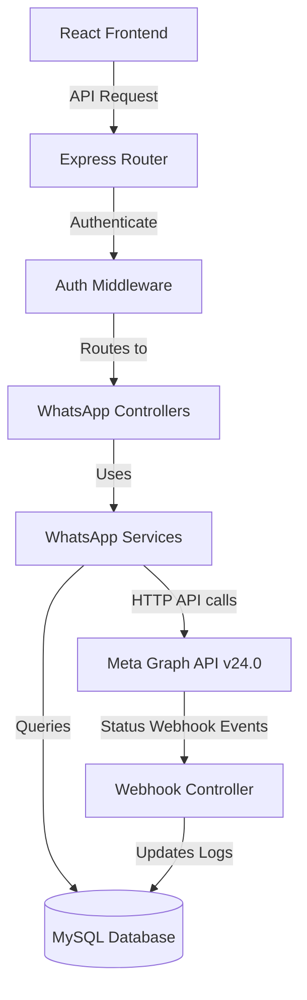

# WhatsApp Module Analysis Report
**Project Name:** Meta API Project (WhatsApp Integration & Management)  
**Date:** June 1, 2026  
**Focus:** Meta WhatsApp Integration, Template Management, Message Flow, Database Analysis, Technical Debt, and AiSensy/WATI/Interakt Gap Analysis.

---

## 1. Existing WhatsApp Architecture

### Module Overview
The WhatsApp module consists of a React-based client dashboard communicating with a Node.js Express server backend. It enables connection to multiple WhatsApp Business accounts (WABA), syncing and building message templates, logging delivery statistics via webhooks, sending bulk template campaigns, and manually tracking external WhatsApp Channel memberships.

### Folder Structure
```
├── Client/src/
│   ├── components/
│   │   ├── whatsapp/
│   │   │   ├── SendMessage.jsx         # Campaign broadcast and CSV/Excel template mapper
│   │   │   ├── WAAnalytics.jsx         # Recharts dashboard for delivery performance
│   │   │   ├── WAChannels.jsx          # Manual WhatsApp channel member tracker
│   │   │   ├── WATemplateBuilder.jsx   # Interactive smartphone drag-and-build mockup
│   │   │   ├── WATemplates.jsx         # Meta templates listing and synchronizer
│   │   │   └── WhatsAppManager.jsx     # Active phone number and WABA status dashboard
│   │   └── WhatsAppSettings.jsx        # Admin credential settings (WABA ID, Phone ID, Access Token)
│   
├── Server/src/
│   ├── routes/
│   │   └── whatsapp/
│   │       └── whatsapp.routes.js      # Declares webhook and protected API endpoints
│   ├── controllers/
│   │   └── whatsapp/
│   │       ├── whatsapp.controller.js  # Configs CRUD, profile detail sync, template broadcast
│   │       ├── whatsapp-templates.controller.js # Template creation/deletion & webhook endpoints
│   │       └── whatsapp-channels.controller.js  # Manual channel tracking logic
│   ├── services/
│   │   ├── whatsapp.service.js         # Meta profile caching & template synchronization
│   │   └── whatsapp-templates.service.js # Meta template CRUD & logs database update
│   └── config/
│       ├── db.js                       # MySQL database pool creation
│       └── initSchema.js               # Database schema declaration
```

### Service Architecture


---

## 2. Meta Integration Analysis

### Meta App Configuration
By default, the platform uses configuration variables defined in backend environment variables (`process.env.META_ACCESS_TOKEN`, `process.env.PHONE_NUMBER_ID`, `process.env.WABA_ID`). 
To support multi-tenancy, administrator users can configure individual sender credentials (phone number configurations) inside `WhatsAppSettings.jsx`. These custom accounts are stored in the MySQL database.

### WABA & Phone Number Integration
When a client requests account details, the server queries the Meta API node `/v24.0/{phone_number_id}` and updates/caches details into `whatsapp_phone_details`:
* **Details retrieved:** `display_phone_number`, `verified_name`, `quality_rating`, `name_status`, `code_verification_status`, `platform_type`, `throughput`.
* WABA metadata (WABA name, review status, currency, timezone, template namespace, business verification status) is queried dynamically using `/{waba_id}`.

### Access Token Handling
Access tokens are passed from the client inside requests using the `X-WhatsApp-Config-Id` header (from local storage `selectedWhatsAppConfigId`). 
* If a custom configuration ID is provided, the backend fetches credentials from the `whatsapp_configs` database.
* Otherwise, it falls back to default server environment variables.

### Webhook Setup
The webhook exposes two public endpoints:
* **GET `/webhook` (Verification):** Validates verify tokens against `process.env.WEBHOOK_VERIFY_TOKEN` (or defaults to `whiteforce_whatsapp_token`).
* **POST `/webhook` (Notification Receiver):** Receives event payloads containing event updates from Meta. It checks for:
  1. **Template Approval Status:** Triggers local updates when templates change to `APPROVED` or `REJECTED`.
  2. **Message Status Notifications:** Captures `sent`, `delivered`, `read`, and `failed` events along with Meta errors.

---

## 3. Template Management

### Template Creation Process
1. Done inside `WATemplateBuilder.jsx` where a visual phone mockup simulates the user's template.
2. Supports **Header** (NONE, TEXT, IMAGE, DOCUMENT), **Body** (supports dynamic variable inputs like `{{1}}`), **Footer** (text), and **Buttons** (QUICK_REPLY, URL web links, PHONE support lines).
3. Payload is compiled into Meta API specifications and sent to `POST /v24.0/{waba_id}/message_templates`.
4. Stored locally in `whatsapp_templates` cache with `PENDING` status.

### Template Sync Process
Synchronizes with Meta on page load or manual refresh. The system checks the cache:
* If the cached templates are older than 15 minutes (`CACHE_TTL_MS = 15 * 60 * 1000`), a fresh query is dispatched to `/{waba_id}/message_templates`.
* Retrieved templates update the `whatsapp_templates` table via `INSERT ... ON DUPLICATE KEY UPDATE`.

### Variable Handling
* Client-side template variables are defined in the template body text using double curly brackets `{{n}}`.
* Dynamic csv/excel columns are matched to the parameters using an interactive **Column Mapping Setup** UI inside `SendMessage.jsx`.
* Parameters are sliced/padded dynamically in-browser before submission to prevent template variable count mismatches.
* The Meta parameters payload is sent as an array of type `"text"`.

### Current Limitations
1. **Body Variables Only:** The server template controller is hardcoded to map variables only to the template's `body` components. Header media variable values, header text variables, and dynamic button link variables are not supported by the backend payload formatter.
2. **One Language Variation:** The template builder does not support multi-language variations of a single template. Each translation has to be submitted as a separate template.
3. **No Local Media Uploads:** The template builder does not handle local media upload (images/PDFs) to Meta's CDN; users must provide public URLs instead.

---

## 4. Message Sending Flow

```
[Upload CSV/Excel] ──> [Map Columns in UI] ──> [Send Broadcast POST]
                                                      │
                                                      ▼
                                            [For Loop in Controller]
                                                      │
                                           ┌──────────┴──────────┐
                                           ▼                     ▼
                                    [Send via Meta]        [Log locally]
                                           │                     │
                                           ▼                     ▼
                                   [Webhook Event] ──────> [Update Status]
```

### Single Message Flow
* Front-end transmits recipient number array via `numbers` in the payload.
* Backend wraps the number into a dummy recipient list `{ number: num, parameters: [] }` and dispatches the Meta Template API request immediately.

### Bulk Message Flow
* Front-end parses Excel (.xlsx, .xls) or CSV in the browser using the library `xlsx`.
* The columns are mapped to the recipient's phone number and the template variables.
* The frontend posts a list of mapped recipients to `POST /api/whatsapp/send-template`.
* The backend iterates through the array sequentially using a synchronous `for` loop, dispatching independent Axios requests to Meta's Graph API for every number.
* Each outcome is appended to a results array and logged as `sent` or `failed` in the SQL message logs.

### Queue & Retry System
* **Queue:** **NONE**. All requests are run sequentially in-process. High numbers of recipients can cause API timeouts or event-loop blockage.
* **Retry Mechanism:** **NONE**. If a dispatch fails, the system logs the error message in the database, skips to the next recipient, and does not retry.

---

## 5. Contact & Campaign Management

### Contact Storage & Importing
* **Storage:** **NONE**. There is no database table representing contacts or contact lists.
* **Importing:** Contacts are imported strictly in-memory by loading spreadsheet rows in client-side React code. Once the tab is closed, the contacts list is lost.

### Campaign Management & Scheduling
* **Campaigns:** **NONE**. There is no option to save campaigns, view campaign statistics retrospectively, or reuse campaigns.
* **Scheduling:** **NONE**. Broadcasts are sent immediately; there is no queue or CRON system for scheduling future dispatches.

---

## 6. Database Analysis

### 1. `whatsapp_configs`
* **Purpose:** Stores WABA accounts credentials to allow multi-tenant sending.
* **Important Columns:**
  * `id` (INT Auto-Increment, PK)
  * `name` (VARCHAR, Account name identifier)
  * `phone_number_id` (VARCHAR, Phone ID provided by Meta)
  * `waba_id` (VARCHAR, Business Account ID)
  * `access_token` (TEXT, Meta Access Token)
* **Relationships:** One-to-many relationship with `whatsapp_phone_details` via `config_id`.

### 2. `whatsapp_phone_details`
* **Purpose:** Caches Meta WhatsApp Business Phone detail specs to minimize Meta API queries.
* **Important Columns:**
  * `phone_number_id` (VARCHAR, Composite PK)
  * `config_id` (INT, Composite PK)
  * `waba_id` (VARCHAR)
  * `display_phone_number` (VARCHAR)
  * `verified_name` (VARCHAR)
  * `quality_rating` (VARCHAR, GREEN/YELLOW/RED)
  * `name_status` (VARCHAR, Meta name verification state)
  * `raw_data` (JSON, full response object)

### 3. `whatsapp_templates`
* **Purpose:** Local template cache database.
* **Important Columns:**
  * `id` (VARCHAR, Meta template ID, PK)
  * `waba_id` (VARCHAR)
  * `name` (VARCHAR)
  * `status` (VARCHAR, e.g., APPROVED/REJECTED/PENDING)
  * `components` (JSON, contains header, body, button specs)

### 4. `whatsapp_message_logs`
* **Purpose:** Tracks all broadcast dispatches and records webhook status replies.
* **Important Columns:**
  * `id` (INT Auto-Increment, PK)
  * `phone_number_id` (VARCHAR)
  * `recipient_number` (VARCHAR)
  * `template_name` (VARCHAR)
  * `status` (VARCHAR, e.g., sent/delivered/read/failed)
  * `message_id` (VARCHAR, Meta messaging receipt ID)
  * `error_message` (TEXT, Meta API errors)

### 5. `whatsapp_channels`
* **Purpose:** Profile storage for manual WhatsApp Channel tracking.
* **Important Columns:**
  * `id` (INT Auto-Increment, PK)
  * `channel_name` (VARCHAR)
  * `manager_name` (VARCHAR)
* **Relationships:** One-to-many relationship with `whatsapp_channel_member_updates` (Cascade delete).

### 6. `whatsapp_channel_member_updates`
* **Purpose:** Historical logs of daily member counts for manual WhatsApp channels.
* **Important Columns:**
  * `id` (INT Auto-Increment, PK)
  * `channel_id` (INT, FK referencing `whatsapp_channels`)
  * `member_count` (INT)
  * `update_date` (DATE)
* **Relationships:** Compound unique key on `(channel_id, update_date)` to restrict logs to one update per day per channel.

---

## 7. Current Features

1. **Multi-Account Connection CRUD:** Connect and manage separate sender profiles (Phone ID, WABA ID, Access Tokens).
2. **WABA Profile Management:** Visualizes verified names, rating scores, throughput bandwidth, and verification status.
3. **Template Library Synchronization:** Pulls approved templates from Meta and caches them in the local database.
4. **Template Deletion & Cloning:** Deletes templates from Meta/Local Cache; duplicates existing templates into the builder.
5. **Interactive Template Builder:** Real-time phone mockup editor rendering Text/Media headers, body texts, footers, and interactive buttons (web, phone call, quick replies).
6. **Robust Webhook Integration:** Live webhook verifying handshake token and syncing delivery status receipts (sent, delivered, read, failed) and template approvals.
7. **Delivery Analytics:** Interactive Recharts dashboard visualizing delivery metrics (Total Sent, Delivered, Read, Failed), volume timelines, status distributions, and template performance.
8. **Interactive Column Mapper:** Custom frontend parser maps CSV/Excel columns to phone numbers and variables, validating variable count structures dynamically.
9. **WhatsApp Channel Tracker:** Manual portal to manage public/private WhatsApp channels, chart membership history, and update daily member counts.

---

## 8. Missing Features (Gap Analysis)

To compete directly with enterprise CRM tools like **AiSensy**, **WATI**, and **Interakt**, the following core features are missing:

| Feature Area | Description | Status | Gap Priority |
| :--- | :--- | :--- | :--- |
| **Shared Team Inbox** | Real-time chat desk for support reps to communicate, assign tickets, tag users, and write notes. | ❌ Missing | **Critical** |
| **Contact Directory & CRM** | Database to save customer contacts, profile attributes, segments, opt-in consent logs, and unsubscribe blacklists. | ❌ Missing | **Critical** |
| **Campaign Scheduler** | Queue manager to schedule broadcast templates for specific future dates or recurring campaigns. | ❌ Missing | **High** |
| **Asynchronous Message Queue** | Background workers (e.g., BullMQ + Redis) to handle bulk broadcast messaging outside the HTTP cycle. | ❌ Missing | **High** |
| **Visual Chatbot Flow Builder** | No-code editor to build automated response flows, keyword triggers, out-of-office automated hours, and welcoming replies. | ❌ Missing | **Medium** |
| **Dynamic Media Templates** | Backend support to dynamically map file attachments, images, and variables inside URL buttons. | ❌ Missing | **Medium** |
| **Third-Party CRM Plugins** | Native webhook integrations to trigger messages from Shopify, WooCommerce, Zoho, HubSpot, etc. | ❌ Missing | **Low** |

---

## 9. Technical Debt / Issues

### 1. Synchronous Bulk Sender (High Risk)
* **Description:** The `sendTemplateMessage` controller loops synchronously through all recipients and awaits each Meta request.
* **Risk:** A list of 1,000 phone numbers will trigger 1,000 sequential API requests inside a single HTTP lifecycle, leading to a gateway timeout (`504 Gateway Timeout`) and event loop blocking. 

### 2. Security Vulnerabilities
* **Tokens Stored in Plain Text:** Admin-configured Meta Access Tokens are written to the database without encryption. If the database is compromised, all user access tokens are leaked.
* **Unsigned Webhook Events:** The `receiveWebhook` controller processes status updates without verifying the Meta request signature (`X-Hub-Signature-256`). A bad actor could send arbitrary HTTP payloads to `/webhook` and corrupt delivery metrics.

### 3. Performance Bottlenecks
* **Cache Blockage:** If cached templates are stale, `getTemplates` syncs templates synchronously during a client's page load request. This blocks the client UI and delays responses if Meta Graph API is slow.
* **Database Indexes:** Key tables like `whatsapp_message_logs` lack indexed columns for `phone_number_id`, `recipient_number`, or `message_id`, which slows down search queries as log size increases.

### 4. Hardcoded Versions
* The API endpoints reference version `/v24.0/` in string literals. If Meta deprecates v24.0, multiple service files will break. Version variables should be stored in environment configurations.

---

## 10. Final Summary

### Progress Estimation
* **Completed (35%):** Core Graph API endpoints, manual configuration dashboard, database schema layout, template sync/deletion, visual template creator, delivery receipt updates via webhooks, and analytics views.
* **Partially Completed (15%):** Webhook updates (needs security validation), Template Builder (lacks dynamic media variables and interactive buttons routing).
* **Missing (50%):** Shared Team Inbox, Contact CRM Directory, Background Queue system, Campaign Schedulers, and Automation Flow Builders.

### Recommended Implementation Roadmap

```
Phase 1: Security & Robustness ──> Phase 2: Asynchronous Queues ──> Phase 3: Contact CRM & Scheduling ──> Phase 4: Shared Team Inbox
```

1. **Phase 1: Security & Stability (Immediate)**
   * Add AES-256 encryption for access tokens stored in `whatsapp_configs`.
   * Implement Meta Signature Verification (`x-hub-signature-256`) inside `receiveWebhook`.
   * Move the Meta Graph API version string (`v24.0`) to a shared environment variable.
2. **Phase 2: Queue Infrastructure (Short Term)**
   * Install **Redis** and setup **BullMQ** on the server.
   * Modify `sendTemplateMessage` to push broadcast requests onto the queue, enabling instant HTTP success response to the client.
   * Create a background worker process that consumes tasks, respects Meta's rate limits, handles retries, and updates database logs.
3. **Phase 3: Contacts CRM & Campaign Scheduling (Medium Term)**
   * Create `contacts`, `contact_lists`, and `campaigns` tables in the database.
   * Add frontend screens to upload spreadsheets, save them as permanent contact lists, and map attributes.
   * Implement a scheduling service (via `node-cron` or BullMQ delayed jobs) to send campaigns at predefined times.
4. **Phase 4: Shared Live Chat Inbox (Long Term)**
   * Establish **Socket.io** integration for real-time bi-directional messaging.
   * Configure the webhook to parse incoming user text messages (instead of just status receipts) and stream them to the live chat interface.
