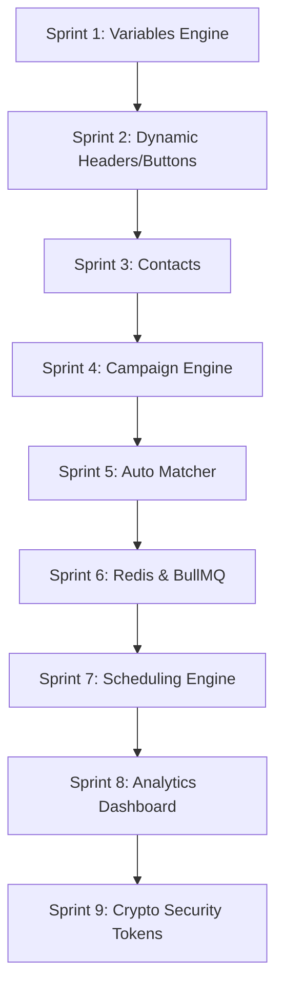

# WhatsApp Product Upgrade Implementation Plan

Detailed engineering plan to upgrade the existing WhatsApp module into a professional, enterprise-grade marketing and broadcast platform (similar to AiSensy, WATI, and Interakt).

---

## 1. Existing Functionality & Reusable Modules

* **WABA Credentials Configurations:** Multi-tenant configs can be created/read/updated/deleted and stored in `whatsapp_configs`.
* **Details Sync & Cache:** Synchronizes phone/WABA stats dynamically and caches them in `whatsapp_phone_details`.
* **Templates Library Cache:** Synchronizes Meta templates and caches their properties (including full component JSON configurations) in `whatsapp_templates`.
* **Template Builder:** Drag-and-build smartphone mockup UI (`WATemplateBuilder.jsx`) supporting header texts, body text variables, footers, and interactive action buttons.
* **Webhook Receiver:** Verify handshakes and handle event updates for template approval statuses and message status timelines (sent, delivered, read, failed).
* **Delivery Analytics:** Dynamic dashboard using Recharts to present delivery shares and template performance charts.

---

## 2. Sprint-by-Sprint Technical Architecture



### Sprint 1: Template Variable Engine
* **Goal:** Support dynamic variable naming (e.g. `{{name}}`, `{{company}}`) in template bodies rather than strict numeric ranges.
* **Database Changes:** Add `variables` (JSON) to the `whatsapp_templates` table.
* **Service logic:** Implement a regex parser `const extractVariables = (text) => [...text.matchAll(/\{\{([a-zA-Z0-9_]+)\}\}/g)].map(m => m[1])` to read and cache variables when templates are created or synchronized.
* **Backward Compatibility:** Numeric placeholders like `{{1}}` are parsed as `["1", "2"]`, maintaining compatibility.

### Sprint 2: Dynamic Template Components
* **Goal:** Support variables in Headers (Text, Image URL, PDF Doc URL) and interactive buttons (Dynamic URL parameters).
* **Database changes:** No new tables; uses cached `components` JSON in `whatsapp_templates`.
* **API changes:** Update payload builder on the server to structure parameters based on their component location (Header, Body, Button) rather than body only.
* **Backward Compatibility:** Templates that only define body variables will map to body parameters without changing existing flows.

### Sprint 3: Contact Management
* **Goal:** Add Lite contact logs and tag segmentation in the WhatsApp module.
* **Database changes:** Create 4 new tables:
  * `whatsapp_contacts` (id, phone, name, email, company, attributes JSON, created_at)
  * `whatsapp_contact_lists` (id, name, created_at)
  * `whatsapp_contact_list_members` (list_id, contact_id, PK compound)
  * `whatsapp_contact_tags` (id, contact_id, tag_name)
* **API changes:**
  * `POST /api/whatsapp/contacts/import` - CSV/Excel upload import endpoint.
  * `GET /api/whatsapp/contacts` - Query contacts, supporting tags, search, and list filter.
  * `POST /api/whatsapp/lists` - Create, read, update, delete custom lists.
* **Frontend changes:** Add a "Contacts" tab inside the WhatsApp module with list creator and CSV/Excel import wizard.

### Sprint 4: Campaign Engine
* **Goal:** Create, save, and track broadcasting campaigns.
* **Database changes:**
  * `whatsapp_campaigns` (id, name, template_id, contact_list_id, campaign_type ['broadcast', 'scheduled', 'recurring'], status ['draft', 'queued', 'running', 'completed', 'failed'], scheduled_time, created_at)
  * `whatsapp_campaign_recipients` (campaign_id, phone, parameters JSON, status, message_id, error_message, sent_at)
* **API changes:**
  * `POST /api/whatsapp/campaigns` - Create dynamic campaign.
  * `GET /api/whatsapp/campaigns/:id` - Detailed progress & recipient delivery lists.
  * `POST /api/whatsapp/campaigns/:id/clone` - Clone campaign.

### Sprint 5: Auto Variable Mapping & Saved Mappings
* **Goal:** Match template variable names automatically to Excel columns or Contact attributes, and save mappings so that they auto-apply in subsequent campaigns.
* **Database changes:** Create table `whatsapp_template_mappings` (template_id, mappings, created_at, updated_at).
* **API changes:**
  * `GET /api/whatsapp/templates/:templateId/mappings` - Retrieve saved mapping profile.
  * `POST /api/whatsapp/templates/:templateId/mappings` - Save or overwrite template column mappings.
* **Frontend changes:** When a template is selected, query the server to check for saved mappings. If found, apply them. On new files, compare metadata keys against imported column headers for auto-matching. Add a checkbox/button to allow users to "Save Mappings for Future Use".

### Sprint 6: Queue Infrastructure (Redis & BullMQ)
* **Goal:** Relieve synchronous server processing of campaigns using a job worker queue.
* **Queue System:**
  * Add Redis connection and initialize BullMQ campaign queue.
  * Backend worker consumes jobs asynchronously, respects Meta's rate limits (throttling), logs errors, and updates recipient progress logs.
* **Backward Compatibility:** Legacy `/api/whatsapp/send-template` remains active, routing requests to the queue immediately as a "Send Now" single-recipient campaign.

### Sprint 7: Campaign Scheduling
* **Goal:** support delayed and recurring campaigns.
* **Service changes:** Use BullMQ delayed jobs (`delay` parameter) when scheduling broadcasts.
* **No cron-based hacks:** BullMQ scheduler schedules the job execution, handling delayed campaigns natively.

### Sprint 8: Analytics Upgrade
* **Goal:** Present campaigns performance indicators in-app.
* **Dashboard modifications:** Add campaigns metrics: delivery rates, read rates, trend curves, and comparison performance tables.

### Sprint 9: Security Improvements
* **Access Token Encryption:** Encrypt `access_token` fields at-rest in MySQL using `aes-256-gcm` (with encryption keys stored in server `.env`).
* **Webhook Signature Verification:** Implement HMAC-SHA256 signature verification in webhook controller:
  ```javascript
  const crypto = require('crypto');
  const signature = req.headers['x-hub-signature-256'];
  const hmac = crypto.createHmac('sha256', process.env.META_APP_SECRET);
  const digest = 'sha256=' + hmac.update(JSON.stringify(req.body)).digest('hex');
  if (signature !== digest) return res.sendStatus(403);
  ```
* **Database Indexing:** Add indexes to search keys: `phone_number_id`, `recipient_number`, `message_id`, `campaign_id`.

---

## 3. Database Migration Strategy

```sql
-- Migration queries schema changes (incremental execution)

-- Sprint 1
ALTER TABLE whatsapp_templates ADD COLUMN variables JSON DEFAULT NULL;

-- Sprint 3
CREATE TABLE IF NOT EXISTS whatsapp_contacts (
    id INT AUTO_INCREMENT PRIMARY KEY,
    phone VARCHAR(50) NOT NULL UNIQUE,
    name VARCHAR(255),
    email VARCHAR(255),
    company VARCHAR(255),
    attributes JSON DEFAULT NULL,
    created_at TIMESTAMP DEFAULT CURRENT_TIMESTAMP
);

CREATE TABLE IF NOT EXISTS whatsapp_contact_lists (
    id INT AUTO_INCREMENT PRIMARY KEY,
    name VARCHAR(255) NOT NULL,
    created_at TIMESTAMP DEFAULT CURRENT_TIMESTAMP
);

CREATE TABLE IF NOT EXISTS whatsapp_contact_list_members (
    list_id INT NOT NULL,
    contact_id INT NOT NULL,
    PRIMARY KEY (list_id, contact_id),
    FOREIGN KEY (list_id) REFERENCES whatsapp_contact_lists(id) ON DELETE CASCADE,
    FOREIGN KEY (contact_id) REFERENCES whatsapp_contacts(id) ON DELETE CASCADE
);

CREATE TABLE IF NOT EXISTS whatsapp_contact_tags (
    id INT AUTO_INCREMENT PRIMARY KEY,
    contact_id INT NOT NULL,
    tag_name VARCHAR(100) NOT NULL,
    FOREIGN KEY (contact_id) REFERENCES whatsapp_contacts(id) ON DELETE CASCADE,
    UNIQUE KEY uq_contact_tag (contact_id, tag_name)
);

-- Sprint 4
CREATE TABLE IF NOT EXISTS whatsapp_campaigns (
    id INT AUTO_INCREMENT PRIMARY KEY,
    name VARCHAR(255) NOT NULL,
    template_id VARCHAR(100) NOT NULL,
    contact_list_id INT NOT NULL,
    campaign_type ENUM('broadcast', 'scheduled', 'recurring') DEFAULT 'broadcast',
    status ENUM('draft', 'queued', 'running', 'completed', 'failed') DEFAULT 'draft',
    scheduled_time TIMESTAMP NULL DEFAULT NULL,
    created_at TIMESTAMP DEFAULT CURRENT_TIMESTAMP,
    FOREIGN KEY (template_id) REFERENCES whatsapp_templates(id),
    FOREIGN KEY (contact_list_id) REFERENCES whatsapp_contact_lists(id)
);

CREATE TABLE IF NOT EXISTS whatsapp_campaign_recipients (
    id INT AUTO_INCREMENT PRIMARY KEY,
    campaign_id INT NOT NULL,
    phone VARCHAR(50) NOT NULL,
    parameters JSON DEFAULT NULL,
    status VARCHAR(50) DEFAULT 'queued',
    message_id VARCHAR(255) DEFAULT NULL,
    error_message TEXT DEFAULT NULL,
    sent_at TIMESTAMP NULL DEFAULT NULL,
    FOREIGN KEY (campaign_id) REFERENCES whatsapp_campaigns(id) ON DELETE CASCADE
);

-- Sprint 5
CREATE TABLE IF NOT EXISTS whatsapp_template_mappings (
    template_id VARCHAR(100) PRIMARY KEY,
    mappings JSON NOT NULL,
    created_at TIMESTAMP DEFAULT CURRENT_TIMESTAMP,
    updated_at TIMESTAMP DEFAULT CURRENT_TIMESTAMP ON UPDATE CURRENT_TIMESTAMP,
    FOREIGN KEY (template_id) REFERENCES whatsapp_templates(id) ON DELETE CASCADE
);

-- Sprint 9 Indexes
CREATE INDEX idx_message_logs_phone ON whatsapp_message_logs(phone_number_id);
CREATE INDEX idx_message_logs_recipient ON whatsapp_message_logs(recipient_number);
CREATE INDEX idx_message_logs_msg_id ON whatsapp_message_logs(message_id);
CREATE INDEX idx_campaign_recipients_phone ON whatsapp_campaign_recipients(phone);
CREATE INDEX idx_campaign_recipients_msg_id ON whatsapp_campaign_recipients(message_id);
```

---

## 4. Risks & Mitigations

| Risk | Description | Mitigation Strategy |
| :--- | :--- | :--- |
| **Meta API Rate Limits** | Sending bulk messages in workers too fast triggers Meta rate limits. | Implement throttling/rate-limiting directly in the BullMQ worker configuration. |
| **Data Loss on Upgrade** | Access tokens are currently saved in plain text. | Migration script runs during startup, reads existing plain tokens, encrypts them, and overwrites the DB field safely. |
| **Queue Delays** | Delayed Redis connections or offline queue workers stall broadcasts. | Add automated fallback logs and alerts showing worker status on the analytics page. |
| **Vite Chunk File Sizes** | Bundle sizes can exceed standard levels due to Recharts imports. | Use Vite code splitting / lazy loading for the new components. |

---

## 5. Verification & Testing Plan

* **Unit Testing:** Write mock test handlers inside `Server/tests` for variable extraction regex and encrypt/decrypt functions.
* **Manual Verification:**
  - Build the production client (`npm run build`) after every sprint to guarantee zero lint/build errors.
  - Test Redis container operations locally to confirm jobs execute sequentially.
  - Submit draft campaigns and check database logs to verify execution timestamps match expected schedules.
