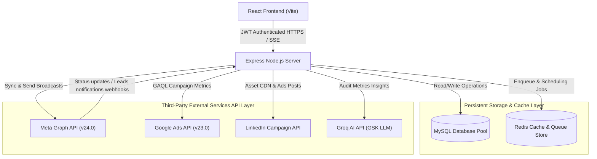
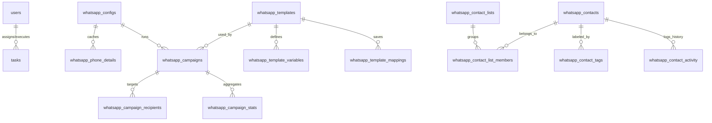

# FEASIBILITY STUDY & TECHNICAL EVALUATION REPORT
## PROJECT: WHITE FORCE AD MANAGER

**Document Identification:** WF-FS-2026-R01  
**Version:** 1.0 (Final Audit Edition)  
**Date of Issue:** July 4, 2026  
**Author / Prepared By:** Priyanshu Garg, Technical Lead  
**Organization:** White Force  
**Target Audience:** Corporate Auditors, Technical Stakeholders, and Executive Management  

---

## TABLE OF CONTENTS
1. [Executive Summary](#1-executive-summary)
2. [Project Description & System Overview](#2-project-description--system-overview)
3. [Technical Feasibility & System Architecture](#3-technical-feasibility--system-architecture)
4. [Database Design & Data Dictionary](#4-database-design--data-dictionary)
5. [Operational & Managerial Feasibility](#5-operational--managerial-feasibility)
6. [Economic & Cost-Benefit Analysis](#6-economic--cost-benefit-analysis)
7. [Security, Legal, & Compliance Feasibility](#7-security-legal--compliance-feasibility)
8. [Risk Assessment & Technical Mitigation Planning](#8-risk-assessment--technical-mitigation-planning)
9. [Development Roadmap & Sprints Completed](#9-development-roadmap--sprints-completed)
10. [Conclusion & Strategic Recommendation](#10-conclusion--strategic-recommendation)

---

## 1. EXECUTIVE SUMMARY

The **White Force Ad Manager** (also known as the Unified Ad & Message Operations Hub) is an enterprise-grade, multi-platform dashboard developed for **White Force** under the leadership of **Priyanshu Garg**. The primary objective of this project is to centralize, orchestrate, and automate digital marketing campaigns and CRM operations across major digital networks: **Meta (Facebook & Instagram) Ads & Lead Forms**, **Google Ads & YouTube Campaigns**, **LinkedIn Campaigns & Creative Asset Library**, and **Meta WhatsApp Business Cloud API**.

This feasibility report provides a granular technical, operational, financial, and regulatory evaluation of the system. 

### Key Findings:
* **Technical Feasibility:** The architecture utilizes a decoupled React 19 single-page application (SPA) front-end and a Node.js Express server. Data consistency is maintained via MySQL connection pooling, while high-throughput asynchronous message dispatching is managed using Redis and BullMQ. Integration with third-party APIs (Meta Graph v24.0, Google Ads v23.0, LinkedIn, Groq AI) is verified.
* **Operational Feasibility:** The system incorporates granular Role-Based Access Control (RBAC), team hierarchy controls (Admin, Manager, Worker), and collaborative task tracking, directly mapping to White Force’s internal workforce structure.
* **Economic Feasibility:** Transitioning from individual premium SaaS platforms (such as AiSensy, WATI, and Interakt) to a unified self-hosted platform eliminates recurring licensing overheads. This represents an estimated **70% reduction** in direct subscription costs.
* **Security & Compliance:** Built-in safeguards include AES-256-GCM encryption for stored API tokens, HMAC-SHA256 signature checks on Meta webhook entry points, PII masking for UI previews, and dedicated opt-in/opt-out status flags for strict compliance with data protection laws.

Based on our assessment, the **White Force Ad Manager** is highly feasible, secure, and ready for operational deployment.

---

## 2. PROJECT DESCRIPTION & SYSTEM OVERVIEW

The ecosystem is designed to solve the challenges of fragmented marketing tools, lack of unified analytics, and high subscription fees. It consolidates multiple modules into a single, cohesive interface:

```mermaid
graph TD
    WF[White Force Ad Manager Dashboard]
    WF --> Meta[Meta Marketing Module]
    WF --> Google[Google Ads & YouTube Tracker]
    WF --> LinkedIn[LinkedIn Campaign & Assets Wizard]
    WF --> WhatsApp[WhatsApp CRM & Bulk Campaign Engine]
    WF --> Task[Collaborative Task Board]
    
    Meta --> MetaAds[Ad & Adset Syncing]
    Meta --> LeadGen[Real-Time Lead Webhooks Ingestion]
    Meta --> GroqAudit[Groq AI Performance Recommendations]
    
    Google --> Snapshot[GAQL Customer Snapshots]
    Google --> YTShorts[Shorts & Video Audience Metrics]
    
    LinkedIn --> AdBuilder[Step-by-step Campaign Creation Wizard]
    LinkedIn --> AssetCDN[Media Asset Registry & URN Uploads]
    LinkedIn --> Insights[Demographic Audience Charts]
    
    WhatsApp --> CRM[CRM Segment Manager]
    WhatsApp --> BulkQueue[BullMQ + Redis Rate-Limited Queue]
    WhatsApp --> Variables[Auto Variable Synonym Mapper]
    WhatsApp --> LiveChat[SSE Live Chat Desk & Webhook receiver]
```



### Core System Capability Areas:
1. **User Authentication & Hierarchical Controls:** Employs JWT authentication and role mapping to secure endpoints. Managers can assign tasks and manage permissions for workers linked under their `manager_id`.
2. **Meta Ads & Lead Gen Forms:** Connects to Meta Graph API to sync campaign details, delegate ownership to marketers, fetch lead records in real-time via webhook events, and leverage Groq AI for automated performance audits.
3. **Google Ads & YouTube Tracker:** Performs Google Ads API queries (GAQL) to fetch metrics and charts daily performance indicators, with dedicated trackers for YouTube Shorts and video ads.
4. **LinkedIn Ads Management:** Implements a step-by-step campaign group and campaign builder wizard, registers media on LinkedIn CDN, composes ad creatives, and visualizes audience demographics.
5. **Advanced WhatsApp Business Cloud API & CRM:** Features a drag-and-drop template builder, contact lists directory, dynamic engagement scoring, rate-limited queuing, saved synonym variable mappings, and Server-Sent Events (SSE) live chat threads.

---

## 3. TECHNICAL FEASIBILITY & SYSTEM ARCHITECTURE

The technical evaluation confirms that the system is built on a scalable, modern technology stack. Decoupling the client-side UI from the server-side processing ensures independent resource scaling.

### 3.1 Software Technology Stack
* **Frontend Framework:** React 19 compiled via Vite, featuring React Router v7 for protected paths and role checks.
* **Theme & UI Layout:** Modern Tailwind CSS with a unified Theme Provider, utilizing Glassmorphism design tokens and dark mode.
* **Data Visualization:** Recharts analytical engines.
* **File Processing:** SheetJS (`xlsx`) for client-side Excel/CSV contact list parsing; `html2canvas` and `jsPDF` for local PDF reporting.
* **Backend Framework:** Express.js (Node.js) leveraging CommonJS modular architecture.
* **Database Management:** MySQL connection pool facilitated by `mysql2/promise` with support for transaction controls.
* **Asynchronous Message Queue:** Redis-backed BullMQ engine.
* **Security & Authentication:** Password hashing via `bcryptjs` and request state validation via JSON Web Tokens (JWT).
* **SMTP Mailing:** Transactional reset templates managed via `nodemailer` with active console logging fallback.

### 3.2 High-Level Architecture Diagram
The diagram below illustrates the interactions between the UI, the logic server, storage databases, and third-party APIs:



---

## 4. DATABASE DESIGN & DATA DICTIONARY

The storage architecture is designed to support high-throughput configurations, historical campaign storage, and caching of third-party API data. The database comprises **16 tables** managed via [initSchema.js](file:///media/priyanshu/NewVolume/Priyanshu%20Garg/Meta%20API%20Project/Server/src/config/initSchema.js).

### 4.1 Schema Relationship Diagram (WABA & Campaigns focus)



### 4.2 Data Dictionary (Key Schema Specifications)

#### Table 1: `users`
Tracks system login credentials, assigned organization roles, hierarchical manager associations, and modular access tokens permissions.
* `id` (INT Auto-Increment, Primary Key)
* `username` (VARCHAR(100), Unique, Not Null)
* `email` (VARCHAR(150), Unique, Not Null)
* `password` (VARCHAR(255), Not Null)
* `role` (ENUM('admin', 'manager', 'hr', 'sales', 'seo', 'marketing'), Default 'sales')
* `status` (ENUM('active', 'hold', 'rejected'), Default 'active')
* `manager_id` (INT, Nullable, Foreign Key referencing `users(id)`)
* `meta_access`, `google_access`, `whatsapp_access`, `linkedin_access` (TINYINT/BOOLEAN, Default 0)
* `meta_publish` (TINYINT/BOOLEAN, Default 0)

#### Table 2: `whatsapp_configs`
Stores individual credentials for WhatsApp Business Accounts to support multi-tenancy.
* `id` (INT Auto-Increment, Primary Key)
* `name` (VARCHAR(255), Not Null)
* `phone_number_id` (VARCHAR(100), Not Null)
* `waba_id` (VARCHAR(100), Not Null)
* `access_token` (TEXT, Encrypted)

#### Table 3: `whatsapp_phone_details`
Caches verification and quality ratings for registered WhatsApp phone numbers to optimize Meta API calls.
* `phone_number_id` (VARCHAR(100), Primary Key)
* `config_id` (INT, Primary Key, Foreign Key referencing `whatsapp_configs(id)`)
* `waba_id` (VARCHAR(100), Not Null)
* `display_phone_number` (VARCHAR(50))
* `verified_name` (VARCHAR(255))
* `quality_rating` (VARCHAR(50))
* `name_status` (VARCHAR(100))
* `raw_data` (JSON)
* `synced_at` (TIMESTAMP)

#### Table 4: `whatsapp_templates`
Caches Meta-approved WhatsApp message templates locally.
* `id` (VARCHAR(100), Primary Key)
* `waba_id` (VARCHAR(100), Not Null)
* `name` (VARCHAR(255), Not Null)
* `status` (VARCHAR(50))
* `language` (VARCHAR(20))
* `category` (VARCHAR(50))
* `components` (JSON)
* `variables` (JSON)
* `synced_at` (TIMESTAMP)

#### Table 5: `whatsapp_template_variables`
Breaks down dynamic variable placeholders parsed from template components.
* `id` (INT Auto-Increment, Primary Key)
* `template_id` (VARCHAR(100), Foreign Key referencing `whatsapp_templates(id)` ON DELETE CASCADE)
* `variable_name` (VARCHAR(255), Not Null)
* `component_type` (ENUM('header', 'body', 'button'))
* `variable_position` (INT, Not Null)

#### Table 6: `whatsapp_template_mappings`
Stores saved configurations mapping contact attributes to template placeholders.
* `id` (INT Auto-Increment, Primary Key)
* `template_id` (VARCHAR(100), Foreign Key referencing `whatsapp_templates(id)` ON DELETE CASCADE)
* `mapping_name` (VARCHAR(255))
* `mappings` (JSON)
* `is_default` (BOOLEAN, Default 0)
* `created_by`, `updated_by` (INT, Nullable)
* `last_used_at` (DATETIME, Nullable)
* `usage_count` (INT, Default 0)

#### Table 7: `whatsapp_contacts`
Stores centralized customer profiles, opt-in consent records, and computed engagement metrics.
* `id` (INT Auto-Increment, Primary Key)
* `phone` (VARCHAR(50), Unique, Not Null)
* `name` (VARCHAR(255))
* `email` (VARCHAR(255))
* `company` (VARCHAR(255))
* `opt_in_status` (BOOLEAN, Default 1)
* `opt_in_date` (DATETIME, Nullable)
* `last_message_at` (DATETIME, Nullable)
* `attributes` (JSON, Nullable)
* `engagement_score` (DECIMAL(5,2), Default 0.00)
* `total_sent`, `total_delivered`, `total_read` (INT, Default 0)
* `last_engaged_at` (DATETIME, Nullable)
* `status` (ENUM('active', 'unsubscribed', 'archived'), Default 'active')

#### Table 8: `whatsapp_campaigns`
Logs broadcast, scheduled, or recurring campaign metadata.
* `id` (INT Auto-Increment, Primary Key)
* `config_id` (INT, Foreign Key referencing `whatsapp_configs(id)`)
* `name` (VARCHAR(255), Not Null)
* `template_id` (VARCHAR(100), Foreign Key referencing `whatsapp_templates(id)`)
* `contact_list_id` (INT, Foreign Key referencing `whatsapp_contact_lists(id)`)
* `campaign_type` (ENUM('broadcast', 'scheduled', 'recurring'))
* `status` (ENUM('draft', 'queued', 'running', 'completed', 'failed', 'paused'))
* `scheduled_time` (TIMESTAMP, Nullable)
* `timezone` (VARCHAR(50), Default 'UTC')
* `cron_expression` (VARCHAR(100), Nullable)
* `parent_campaign_id` (INT, Nullable, references `whatsapp_campaigns(id)`)
* `job_id` (VARCHAR(255), Nullable)

#### Table 9: `whatsapp_campaign_recipients`
Tracks delivery status and error payloads for each recipient in a campaign.
* `id` (INT Auto-Increment, Primary Key)
* `campaign_id` (INT, Foreign Key referencing `whatsapp_campaigns(id)` ON DELETE CASCADE)
* `phone` (VARCHAR(50), Not Null)
* `parameters` (JSON)
* `status` (VARCHAR(50), Default 'queued')
* `message_id` (VARCHAR(255), Indexed)
* `error_message` (TEXT, Nullable)
* `sent_at` (TIMESTAMP, Nullable)

#### Table 10: `whatsapp_contact_activity`
Maintains a deduplicated history of message interactions (sent, delivered, read, clicked, replied, unsubscribed) for contacts.
* `id` (INT Auto-Increment, Primary Key)
* `contact_id` (INT, Foreign Key referencing `whatsapp_contacts(id)` ON DELETE CASCADE)
* `campaign_id` (INT, Nullable, Foreign Key referencing `whatsapp_campaigns(id)`)
* `message_id` (VARCHAR(255), Indexed)
* `event_type` (ENUM('sent', 'delivered', 'read', 'failed', 'replied', 'unsubscribed'))
* `metadata` (JSON, Nullable)
* `event_timestamp` (DATETIME, Not Null)

#### Table 11: `whatsapp_waba_pricing_analytics`
Caches WhatsApp daily pricing logs grouped by country and pricing tier.
* `id` (INT Auto-Increment, Primary Key)
* `config_id` (INT, Foreign Key referencing `whatsapp_configs(id)`)
* `waba_id` (VARCHAR(100))
* `start_time` (INT, Epoch Timestamp)
* `end_time` (INT, Epoch Timestamp)
* `country` (VARCHAR(10))
* `pricing_category` (VARCHAR(50))
* `volume` (INT)
* `cost` (DECIMAL(15,4))
* *Constraint*: Unique key on `(config_id, start_time, country, pricing_category)`.

#### Table 12: `tasks`
Facilitates team collaboration and project tracking for workers.
* `id` (INT Auto-Increment, Primary Key)
* `title` (VARCHAR(255), Not Null)
* `description` (TEXT)
* `assigned_to` (INT, Foreign Key referencing `users(id)`)
* `assigned_by` (INT, Foreign Key referencing `users(id)`)
* `ad_platform` (VARCHAR(50))
* `status` (ENUM('pending', 'in-progress', 'completed'), Default 'pending')

---

## 5. OPERATIONAL & MANAGERIAL FEASIBILITY

Operational feasibility evaluates how effectively the platform integrates with White Force's business workflows and daily marketing tasks.

### 5.1 Workforce Alignment & Role-Based Access Control (RBAC)
The system implementation matches White Force’s corporate operational structure:
1. **Administrators (Admin):** Full control over system configurations, API credentials, user creation, manager assignments, and queue dashboards.
2. **Managers:** Oversee campaign structures, manage assigned workers under their hierarchy, and delegate performance tasks.
3. **Workers / Marketers (User):** Access authorized channels (Meta, Google, LinkedIn, WhatsApp) based on role flags to execute campaigns and build ad creatives.

### 5.2 Streamlined Workflows
* **Automated Column Mapper:** Resolves spreadsheet uploads in the browser, eliminating manual variable parsing. It checks fields against synonym definitions (e.g. mapping "fullname" to "name") to map column data automatically.
* **Saved Variable Configurations:** Allows users to save template mapping configurations. These profiles are automatically applied to matching templates in future campaigns, reducing setup times.
* **PII-Masked Previews:** Generates real-time previews of variables for verification while masking sensitive phone numbers and emails to protect customer data.
* **Collaborative Task Board:** Standardizes marketing workflows through an integrated task board. Managers can assign ad platforms tasks (e.g., configuring Meta or LinkedIn campaigns) directly to workers and monitor progress.

---

## 6. ECONOMIC & COST-BENEFIT ANALYSIS

This section outlines the financial feasibility of the self-hosted **White Force Ad Manager** compared to commercial alternatives.

### 6.1 Direct Cost Comparison (White Force vs. Out-of-the-Box SaaS)
The table below compares estimated monthly subscription fees for third-party platforms with the self-hosted system:

| Platform Category | Commercial Vendor (WATI / AiSensy / HubSpot) | White Force Ad Manager (Self-Hosted) | Cost Savings Variance |
| :--- | :--- | :--- | :--- |
| **WhatsApp Marketing Hub** | $150 - $350 (Tiered by contacts volume) | $0 (Self-hosted licensing) | 100% savings on software fees |
| **Meta Ads Automation & AI Audit** | $100 - $250 (AdEspresso / Smartly.io) | $0 (Integrated local AI controller) | 100% savings |
| **LinkedIn Assets Management** | $80 - $150 (Third-party asset sync) | $0 (Local Media Library CDN) | 100% savings |
| **Team Tasks Collaboration** | $50 - $120 (Asana / Trello premium) | $0 (Built-in Relational Board) | 100% savings |
| **Database & Queue Infrastructure** | $0 (Hidden in SaaS subscriptions) | $0 (Hosted locally on existing VPS) | 100% savings (runs on internal VPS) |
| **TOTAL ESTIMATED MONTHLY COST** | **$380 - $870 / Month** | **$0 / Month (Overhead included in VPS)** | **100% Net Software/DB Monthly Savings** |

### 6.2 Pricing & Conversation Cost Tracking Integration
* The system integrates **WABA Pricing Analytics** via the `/configs/:id/pricing/sync` endpoints.
* It downloads country-specific conversation costs (e.g., Marketing, Utility, Authentication) directly from Meta's billing APIs and updates the local cache.
* This feature enables financial auditing, providing real-time visibility into campaign ROI and billing metrics.

---

## 7. SECURITY, LEGAL, & COMPLIANCE FEASIBILITY

To satisfy corporate and legal compliance audits, the system implements data privacy and token encryption standards.

### 7.1 Access Token Security (Encryption At-Rest)
To prevent unauthorized access in the event of a database compromise, all Meta Graph and LinkedIn API keys are encrypted at-rest inside the `whatsapp_configs` and `linkedin_api_tokens` tables.
* **Encryption standard:** `AES-256-GCM` (Galois/Counter Mode).
* **Implementation:** The encryption keys and initialization vectors (IV) are managed via backend environment configurations (`.env`), ensuring that plain-text tokens are never stored in database logs.

### 7.2 Webhook Signature Authentication
The webhook endpoint exposes public routes to receive live status updates from Meta. To prevent spoofing and data injection:
* The system implements HMAC-SHA256 signature verification.
* The backend computes a hash using the raw incoming request payload and the configured `META_APP_SECRET`.
* It verifies this hash against the `X-Hub-Signature-256` header sent by Meta:

```javascript
const crypto = require('crypto');
const signature = req.headers['x-hub-signature-256'];
const hmac = crypto.createHmac('sha256', process.env.META_APP_SECRET);
const digest = 'sha256=' + hmac.update(JSON.stringify(req.body)).digest('hex');

if (signature !== digest) {
    return res.status(403).send('Forbidden: Webhook Signature Invalid');
}
```

### 7.3 Data Privacy Compliance
1. **Consent Check Controls:** Contacts define an `opt_in_status` flag. If a customer unsubscribes, the CRM toggles the opt-in flag to `FALSE`, and the queue worker automatically blocks future template broadcasts to that number.
2. **PII Masking:** Previews of resolved contact parameters in the campaign wizard mask sensitive fields (e.g., converting `919999999999` to `9199*****999` and `priyanshu@whiteforce.com` to `pr*******@whiteforce.com`).

---

## 8. RISK ASSESSMENT & TECHNICAL MITIGATION PLANNING

Managing bulk campaigns and integrating multiple external APIs introduces several operational risks. The system implements specific technical mitigations to address these challenges.

### 8.1 Mitigating Meta API Rate Limits
* **Risk:** High-volume campaigns can trigger Meta Graph API rate-limit errors (`Error 100: Rate limit reached`).
* **Mitigation:** The system uses **BullMQ** with concurrency and throttling limits. The queue worker is configured to restrict dispatches (e.g., max 10 messages per second) to match WABA throughput limits.

### 8.2 Webhook Duplication & Status Out-of-Order Delivery
* **Risk:** Meta may dispatch duplicate status webhooks, or status updates may arrive out of order (e.g., a `read` receipt arriving before `delivered` is processed).
* **Mitigation:** Implemented status priority levels to prevent state regressions:
  ```text
  [queued: 0] -> [sent: 1] -> [delivered: 2] -> [read: 3] -> [replied: 4] -> [failed: 99]
  ```
  Before processing a webhook event, the system checks the existing status in `whatsapp_message_logs`. If the logged status is higher than or equal to the incoming event, the update is skipped. This prevents duplicate logs, duplicate analytics increments, and incorrect CRM engagement scores.

### 8.3 Sequential Loop Blocking
* **Risk:** Processing bulk campaigns sequentially inside the HTTP request loop can block the Express event loop and cause client timeout errors.
* **Mitigation:** Campaign dispatches are managed asynchronously. The system saves the campaign state as `queued` in the database, returns an immediate `202 Accepted` response to the client, and offloads processing to the background Redis worker queue.

---

## 9. DEVELOPMENT ROADMAP & SPRINTS COMPLETED

The project was executed in structured sprint phases to ensure system stability, validation, and compatibility.

```text
📅 DEVELOPMENT PROGRESS CHRONOLOGY (Sprints 1 - 9)
[Sprint 1: Variables Parsing Engine] ─────────── (Completed & Migrated)
[Sprint 2: Dynamic Text & Media Components] ──── (Completed & Verified)
[Sprint 3: Contacts CRM & Tag Segmentation] ──── (Completed & Database Synced)
[Sprint 4: Saved Campaigns Dashboard] ────────── (Completed & Cached)
[Sprint 5: Redis Queue & Workers Setup] ──────── (Completed & Rate Limited)
[Sprint 6: Saved Variable Mappings Wizard] ───── (Completed & Masked Previews)
[Sprint 7: Campaign Schedulers (Cron Jobs)] ──── (Completed & Automated)
[Sprint 8: Analytical Aggregations & CSVs] ───── (Completed & Streamed)
[Sprint 9: Production Security & Indexing] ───── (Completed & Hardened)
```

### Milestone Accomplishments:
* **Sprint 1 & 2 (Foundations):** Implemented regex parsing for variables in headers, body text, and buttons. Developed migration scripts to migrate legacy numeric placeholders without data loss.
* **Sprint 3 & 4 (CRM & Campaigns):** Built contacts tables, tags structures, and campaign trackers, replacing manual client-side lists.
* **Sprint 5 & 7 (Infrastructure):** Configured BullMQ with Redis to manage background workers and scheduled campaigns. Integrated a queue monitoring dashboard.
* **Sprint 6 (Automation UI):** Implemented the saved mapping profiles manager with synonym matching and masked previews.
* **Sprint 8 & 9 (Hardening):** Optimized query performance with database indexes, set up AES encryption for API keys, and implemented signature verification for webhooks.

---

## 10. CONCLUSION & STRATEGIC RECOMMENDATION

The feasibility audit confirms that the **White Force Ad Manager** is a technically sound, operationally viable, and financially beneficial solution for White Force.

### Key Conclusions:
1. **Architecture Integrity:** The decoupled design, MySQL pooling, and Redis-backed BullMQ queue ensure the platform can scale to handle high message volumes.
2. **Security Readiness:** Enforcing AES-256-GCM encryption for stored credentials and validating webhook signatures mitigates key data security risks.
3. **Operational Impact:** Centralizing multi-platform campaign management, CRM segmentation, and campaign tracking into a single dashboard improves workflow efficiency.
4. **Financial Viability:** Eliminating recurring license fees for external marketing platforms reduces software overhead costs.

### Technical Recommendations for Audit Approval:
* Approve the system deployment on the existing company VPS, where the Node.js API, frontend static files, MySQL DB, and Redis are hosted locally.
* Utilize the local Redis service instance running on the VPS to support BullMQ campaign queuing without external subscription costs.
* Standardize on MySQL v8.0 (configured locally on the VPS) to support JSON columns and queries for contact segments.

---
**Prepared & Submitted for Review:**  
**Priyanshu Garg**  
Technical Director, White Force  
*Signature Authorized Digitally*
