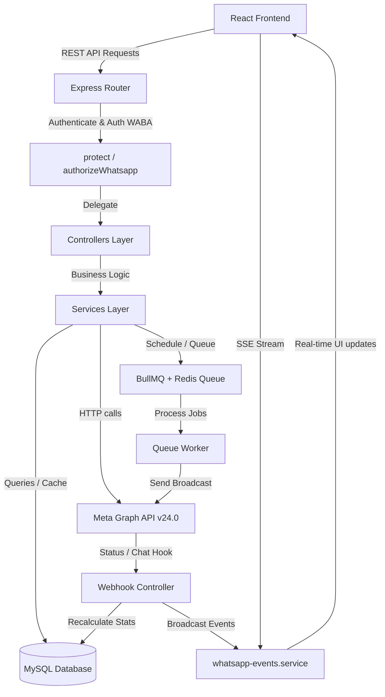
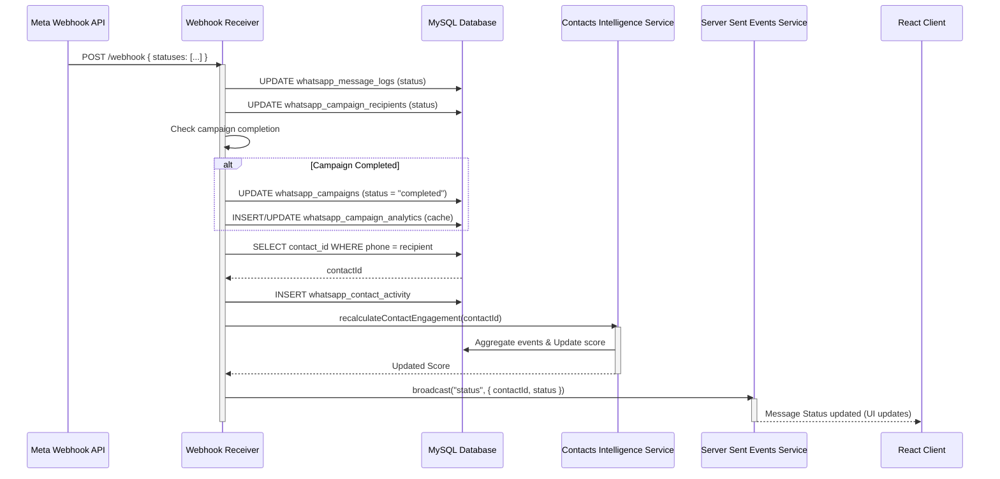
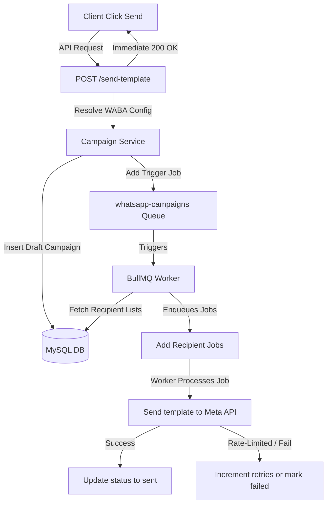

# WhatsApp Integration & Marketing Automation Engine
## Complete System Documentation & Technical Blueprint

This document provides a senior-level, comprehensive analysis and technical blueprint of the **WhatsApp Integration & Marketing Automation Engine** implemented within the Meta API Project. It spans the React-based Client-side Dashboard, the Node.js Express Server-side Controllers/Services, the Redis/BullMQ Asynchronous Queue, and the MySQL Database Schema.

---

## 1. System Architecture & Component Mapping

The WhatsApp module is designed as a multi-tenant, high-throughput marketing automation suite. It connects directly to Meta's Cloud API (Graph API v24.0) to manage accounts, synchronize templates, process webhooks, run rate-limited bulk campaigns, track manual channel counts, and support live support chats.

### High-Level Architecture Diagram



### File Component Mapping

* **Client Components** (`Client/src/components/whatsapp/`):
  * [SendMessage.jsx](file:///media/priyanshu/NewVolume/Priyanshu%20Garg/Meta%20API%20Project/Client/src/components/whatsapp/SendMessage.jsx): Quick-send & Spreadsheet (CSV/XLSX) parser & variable mapper.
  * [WAAnalytics.jsx](file:///media/priyanshu/NewVolume/Priyanshu%20Garg/Meta%20API%20Project/Client/src/components/whatsapp/WAAnalytics.jsx): Analytics views (KPI cards, Recharts, comparisons, pricing, exports).
  * [WACampaigns.jsx](file:///media/priyanshu/NewVolume/Priyanshu%20Garg/Meta%20API%20Project/Client/src/components/whatsapp/WACampaigns.jsx): Campaign logger, cloning, wizards, dynamic parameters mapper.
  * [WAChannels.jsx](file:///media/priyanshu/NewVolume/Priyanshu%20Garg/Meta%20API%20Project/Client/src/components/whatsapp/WAChannels.jsx): Daily subscriber count logger & Recharts analytics.
  * [WAChatWindow.jsx](file:///media/priyanshu/NewVolume/Priyanshu%20Garg/Meta%20API%20Project/Client/src/components/whatsapp/WAChatWindow.jsx): Live customer chat threads UI (SSE live updates, text dispatch).
  * [WAContacts.jsx](file:///media/priyanshu/NewVolume/Priyanshu%20Garg/Meta%20API%20Project/Client/src/components/whatsapp/WAContacts.jsx): Contacts Directory, custom attributes, filters, detail slide-overs.
  * [WALiveAnalytics.jsx](file:///media/priyanshu/NewVolume/Priyanshu%20Garg/Meta%20API%20Project/Client/src/components/whatsapp/WALiveAnalytics.jsx): Real-time analytics charts queried directly from Meta.
  * [WAPricingAnalytics.jsx](file:///media/priyanshu/NewVolume/Priyanshu%20Garg/Meta%20API%20Project/Client/src/components/whatsapp/WAPricingAnalytics.jsx): Price monitoring grouped by category & country.
  * [WASchedules.jsx](file:///media/priyanshu/NewVolume/Priyanshu%20Garg/Meta%20API%20Project/Client/src/components/whatsapp/WASchedules.jsx): Active repeating cron tasks & BullMQ delayed queues viewer.
  * [WATemplateBuilder.jsx](file:///media/priyanshu/NewVolume/Priyanshu%20Garg/Meta%20API%20Project/Client/src/components/whatsapp/WATemplateBuilder.jsx): Drag-and-drop template builder with visual smartphone mockup.
  * [WATemplates.jsx](file:///media/priyanshu/NewVolume/Priyanshu%20Garg/Meta%20API%20Project/Client/src/components/whatsapp/WATemplates.jsx): Active templates lists & variables profile mapping UI.
  * [WhatsAppManager.jsx](file:///media/priyanshu/NewVolume/Priyanshu%20Garg/Meta%20API%20Project/Client/src/components/whatsapp/WhatsAppManager.jsx): Settings verification dashboard, quality rating, raw API response.
  * [WhatsAppSettings.jsx](file:///media/priyanshu/NewVolume/Priyanshu%20Garg/Meta%20API%20Project/Client/src/components/WhatsAppSettings.jsx): Multi-account credentials settings UI.
  
* **Server Routes & Controllers** (`Server/src/`):
  * [whatsapp.routes.js](file:///media/priyanshu/NewVolume/Priyanshu%20Garg/Meta%20API%20Project/Server/src/routes/whatsapp/whatsapp.routes.js): Endpoint directory (Webhooks, API access, Bull Board UI).
  * [whatsapp.controller.js](file:///media/priyanshu/NewVolume/Priyanshu%20Garg/Meta%20API%20Project/Server/src/controllers/whatsapp/whatsapp.controller.js): Account credentials CRUD, synced profile specs.
  * [whatsapp-templates.controller.js](file:///media/priyanshu/NewVolume/Priyanshu%20Garg/Meta%20API%20Project/Server/src/controllers/whatsapp/whatsapp-templates.controller.js): Meta template submits, variables mapping, webhook receiver.
  * [whatsapp-contacts.controller.js](file:///media/priyanshu/NewVolume/Priyanshu%20Garg/Meta%20API%20Project/Server/src/controllers/whatsapp/whatsapp-contacts.controller.js): CRM contacts directory, importings, live chat, SSE.
  * [whatsapp-campaigns.controller.js](file:///media/priyanshu/NewVolume/Priyanshu%20Garg/Meta%20API%20Project/Server/src/controllers/whatsapp/whatsapp-campaigns.controller.js): Campaign scheduling, pause, resume, cloning.
  * [whatsapp-analytics.controller.js](file:///media/priyanshu/NewVolume/Priyanshu%20Garg/Meta%20API%20Project/Server/src/controllers/whatsapp/whatsapp-analytics.controller.js): Aggregations, metrics comparative analytics, CSV streamers.
  * [whatsapp-channels.controller.js](file:///media/priyanshu/NewVolume/Priyanshu%20Garg/Meta%20API%20Project/Server/src/controllers/whatsapp/whatsapp-channels.controller.js): Manual channel subscriber tracking.
  
* **Server Services & Configs** (`Server/src/`):
  * [whatsapp.service.js](file:///media/priyanshu/NewVolume/Priyanshu%20Garg/Meta%20API%20Project/Server/src/services/whatsapp.service.js): Core credentials resolver, template sync, template variables parser.
  * [whatsapp-templates.service.js](file:///media/priyanshu/NewVolume/Priyanshu%20Garg/Meta%20API%20Project/Server/src/services/whatsapp-templates.service.js): Mappings CRUD, template creations, webhook incoming messages handler.
  * [whatsapp-contacts.service.js](file:///media/priyanshu/NewVolume/Priyanshu%20Garg/Meta%20API%20Project/Server/src/services/whatsapp-contacts.service.js): CRM db operations, attribute keys, chat threads.
  * [whatsapp-contacts-intelligence.service.js](file:///media/priyanshu/NewVolume/Priyanshu%20Garg/Meta%20API%20Project/Server/src/services/whatsapp-contacts-intelligence.service.js): Dynamic engagement scoring engine & segment allocations.
  * [whatsapp-campaigns.service.js](file:///media/priyanshu/NewVolume/Priyanshu%20Garg/Meta%20API%20Project/Server/src/services/whatsapp-campaigns.service.js): Campaign triggers, BullMQ repeat registry, schedules.
  * [whatsapp-analytics.service.js](file:///media/priyanshu/NewVolume/Priyanshu%20Garg/Meta%20API%20Project/Server/src/services/whatsapp-analytics.service.js): Snapshot caches, trends gap filling, CSV generators.
  * [whatsapp-events.service.js](file:///media/priyanshu/NewVolume/Priyanshu%20Garg/Meta%20API%20Project/Server/src/services/whatsapp-events.service.js): SSE client stream manager.
  * [whatsapp-queue.service.js](file:///media/priyanshu/NewVolume/Priyanshu%20Garg/Meta%20API%20Project/Server/src/services/whatsapp-queue.service.js): BullMQ orchestration, bulk enqueuer, rate-limited worker.
  * [db.js](file:///media/priyanshu/NewVolume/Priyanshu%20Garg/Meta%20API%20Project/Server/src/config/db.js): MySQL database pool creation.
  * [initSchema.js](file:///media/priyanshu/NewVolume/Priyanshu%20Garg/Meta%20API%20Project/Server/src/config/initSchema.js): Database schema declaration.

---

## 2. Database Schema Deep Dive (MySQL)

The database utilizes **16 tables** to manage credentials, logs, caches, campaigns, templates, variables, mappings, contacts, lists, and activity logs.

### 1. `whatsapp_configs`
Stores WABA sender credentials to enable multi-tenant configurations.
* `id` (INT AUTO_INCREMENT, PK): Primary configuration ID.
* `name` (VARCHAR(255), NOT NULL): Profile label name.
* `phone_number_id` (VARCHAR(100), NOT NULL): Sender Phone ID from Meta.
* `waba_id` (VARCHAR(100), NOT NULL): WhatsApp Business Account ID.
* `access_token` (TEXT, NOT NULL): Meta access token (plain text).
* `created_at` (TIMESTAMP): Auto creation date.
* `updated_at` (TIMESTAMP): Update date tracking.

### 2. `whatsapp_phone_details`
Caches phone profile attributes from Meta to minimize external API rate-limiting.
* `phone_number_id` (VARCHAR(100), PK): Primary ID.
* `config_id` (INT, PK, Default 0): References `whatsapp_configs(id)`.
* `waba_id` (VARCHAR(100), NOT NULL): References configuration.
* `display_phone_number` (VARCHAR(50)): Public display number.
* `verified_name` (VARCHAR(255)): Verified brand name.
* `quality_rating` (VARCHAR(50)): Health index rating (`GREEN`, `YELLOW`, `RED`).
* `name_status` (VARCHAR(100), Default `NONE`): Approval state of verified display name.
* `raw_data` (JSON): Complete cached metadata payload from Meta.
* `synced_at` (TIMESTAMP): Date of last sync.

### 3. `whatsapp_templates`
Local cache of WhatsApp message templates approved by Meta.
* `id` (VARCHAR(100), PK): Unique Template ID from Meta.
* `waba_id` (VARCHAR(100), NOT NULL): Belongs to account.
* `name` (VARCHAR(255), NOT NULL): Template text identifier name.
* `status` (VARCHAR(50)): Template state (`APPROVED`, `REJECTED`, `PENDING`).
* `language` (VARCHAR(20)): Template language code (e.g. `en_US`, `hi_IN`).
* `category` (VARCHAR(50)): Template category (`MARKETING`, `UTILITY`, `AUTHENTICATION`).
* `components` (JSON): Structural layouts (header format, body text, buttons).
* `variables` (JSON): Array caching extracted parameter variable names.
* `synced_at` (TIMESTAMP): Last synchronized timestamp.

### 4. `whatsapp_template_variables`
Detailed breakdown of dynamic parameters mapped to component layouts.
* `id` (INT AUTO_INCREMENT, PK): Primary ID.
* `template_id` (VARCHAR(100), NOT NULL, FK -> `whatsapp_templates(id)`): Belongs to template.
* `variable_name` (VARCHAR(255), NOT NULL): Name of variable (e.g. `first_name` or `1`).
* `component_type` (ENUM('header','body','button'), NOT NULL): Layout component section.
* `variable_position` (INT, NOT NULL): The position index (1-based) within that component type.
* `created_at` (TIMESTAMP): Creation date.

### 5. `whatsapp_template_mappings`
Stores dynamic profiles mapping CRM contact attributes to template placeholders.
* `id` (INT AUTO_INCREMENT, PK): Primary ID.
* `template_id` (VARCHAR(100), FK -> `whatsapp_templates(id)`): Target template.
* `mapping_name` (VARCHAR(255), NOT NULL): Profile label (e.g. "Default Mapping").
* `mappings` (JSON, NOT NULL): Maps placeholder positions to custom attributes.
* `is_default` (BOOLEAN, Default FALSE): Indicates default profile.
* `created_by`/`updated_by` (INT, Nullable): Tracks editor actions.
* `last_used_at` (DATETIME, Nullable): Tracks usage frequency.
* `usage_count` (INT, Default 0): Counts uses.
* `created_at`/`updated_at` (TIMESTAMP): Auto dates.
* *Constraint*: Unique key on `(template_id, mapping_name)`.

### 6. `whatsapp_message_logs`
Historical messaging records and audit logs.
* `id` (INT AUTO_INCREMENT, PK): Primary ID.
* `phone_number_id` (VARCHAR(100), NOT NULL): Sender ID.
* `recipient_number` (VARCHAR(50), NOT NULL): Destination phone.
* `template_name` (VARCHAR(255), NOT NULL): Active layout name.
* `status` (VARCHAR(50), Default `sent`): Delivery state (`sent`, `delivered`, `read`, `failed`).
* `message_id` (VARCHAR(255), Indexed): Unique WhatsApp messaging receipt ID.
* `sent_by` (INT, Nullable): ID of user who sent the message.
* `error_message` (TEXT, Nullable): Meta-returned error details.
* `sent_at` (TIMESTAMP): Date sent.

### 7. `whatsapp_contacts`
Central customer CRM profile directory.
* `id` (INT AUTO_INCREMENT, PK): Primary ID.
* `phone` (VARCHAR(50), UNIQUE, NOT NULL): Phone number (digits only).
* `name` (VARCHAR(255)): Customer display name.
* `email` (VARCHAR(255)): Email address.
* `company` (VARCHAR(255)): Company name.
* `opt_in_status` (BOOLEAN, Default TRUE): Opt-in consent flag.
* `opt_in_date` (DATETIME, Nullable): Date of consent change.
* `last_message_at` (DATETIME, Nullable): Last chat activity.
* `attributes` (JSON, Nullable): Custom dynamic properties.
* `engagement_score` (DECIMAL(5,2), Default 0.00): Dynamically calculated score.
* `total_sent`/`total_delivered`/`total_read` (INT, Default 0): Computed volumes.
* `last_engaged_at` (DATETIME, Nullable): Last delivered/read timestamp.
* `status` (ENUM('active','unsubscribed','archived'), Default `active`): Subscriber status.
* `created_at` (TIMESTAMP): Import date.

### 8. `whatsapp_contact_lists`
Logical grouping list of customer contacts.
* `id` (INT AUTO_INCREMENT, PK): Primary ID.
* `name` (VARCHAR(255), NOT NULL): List label name.
* `created_at` (TIMESTAMP): Creation date.

### 9. `whatsapp_contact_list_members`
Bridge table linking contacts to groupings.
* `list_id` (INT, PK, FK -> `whatsapp_contact_lists(id)` ON DELETE CASCADE)
* `contact_id` (INT, PK, FK -> `whatsapp_contacts(id)` ON DELETE CASCADE)

### 10. `whatsapp_contact_tags`
Dynamic taxonomy labels assigned to customer profiles.
* `id` (INT AUTO_INCREMENT, PK)
* `contact_id` (INT, FK -> `whatsapp_contacts(id)` ON DELETE CASCADE)
* `tag_name` (VARCHAR(100), NOT NULL)
* *Constraint*: Unique key on `(contact_id, tag_name)`.

### 11. `whatsapp_contact_activity`
Deduplicated granular timeline logs of communication events.
* `id` (INT AUTO_INCREMENT, PK)
* `contact_id` (INT, FK -> `whatsapp_contacts(id)` ON DELETE CASCADE)
* `campaign_id` (INT, Nullable, FK -> `whatsapp_campaigns(id)` ON DELETE CASCADE)
* `message_id` (VARCHAR(255), Nullable, Indexed)
* `event_type` (ENUM('sent','delivered','read','failed','replied','unsubscribed'), NOT NULL)
* `metadata` (JSON, contains message body, errors, configuration IDs)
* `event_timestamp` (DATETIME, NOT NULL): Logged date of event.
* `created_at` (TIMESTAMP): DB insertion date.

### 12. `whatsapp_campaigns`
Broadcast, scheduled, or repeating cron-based marketing campaigns.
* `id` (INT AUTO_INCREMENT, PK): Primary ID.
* `config_id` (INT, Default 0): References WABA account.
* `name` (VARCHAR(255), NOT NULL): Campaign label.
* `template_id` (VARCHAR(100), FK -> `whatsapp_templates(id)`): Layout layout ID.
* `contact_list_id` (INT, FK -> `whatsapp_contact_lists(id)`): Targeted directory list.
* `campaign_type` (ENUM('broadcast', 'scheduled', 'recurring'), Default `broadcast`)
* `status` (ENUM('draft', 'queued', 'running', 'completed', 'failed', 'paused'), Default `draft`)
* `scheduled_time` (TIMESTAMP, Nullable): One-time launch target.
* `timezone` (VARCHAR(50), Default `UTC`): Cron timezone offset.
* `cron_expression` (VARCHAR(100), Nullable): Repeating job syntax.
* `parent_campaign_id` (INT, Nullable, FK -> `whatsapp_campaigns(id)` ON DELETE SET NULL): Links recurring runs back to parent profile.
* `job_id` (VARCHAR(255), Nullable): BullMQ scheduled repeatable registry handle.
* `created_at` (TIMESTAMP): Setup date.

### 13. `whatsapp_campaign_recipients`
Individual targets inside a campaign execution log.
* `id` (INT AUTO_INCREMENT, PK): Primary ID.
* `campaign_id` (INT, FK -> `whatsapp_campaigns(id)` ON DELETE CASCADE): Links back to campaign.
* `phone` (VARCHAR(50), NOT NULL): Target number.
* `parameters` (JSON): List of variable values mapped to recipient.
* `status` (VARCHAR(50), Default `queued`): Event status (`queued`, `processing`, `sent`, `delivered`, `read`, `failed`).
* `message_id` (VARCHAR(255), Indexed): Message ID from Meta.
* `error_message` (TEXT): Diagnostic logs if dispatch fails.
* `sent_at` (TIMESTAMP, Nullable): Actual sent timestamp.

### 14. `whatsapp_campaign_stats`
Aggregated campaign metrics.
* `campaign_id` (INT, PK, FK -> `whatsapp_campaigns(id)` ON DELETE CASCADE)
* `total_count` (INT, Default 0): Total recipients.
* `sent_count`/`delivered_count`/`read_count`/`failed_count` (INT, Default 0)
* `delivery_rate`/`read_rate` (DECIMAL(5,2), Default 0.00)
* `updated_at` (TIMESTAMP): Auto dates update tracker.

### 15. `whatsapp_campaign_analytics`
Optimized snapshot caches for dashboard widgets.
* `campaign_id` (INT, PK, FK -> `whatsapp_campaigns(id)` ON DELETE CASCADE)
* `sent_count`/`delivered_count`/`read_count`/`failed_count` (INT, Default 0)
* `last_calculated_at` (TIMESTAMP): Date updated.

### 16. `whatsapp_waba_pricing_analytics`
WABA pricing category aggregates synced from Meta.
* `id` (INT AUTO_INCREMENT, PK)
* `config_id` (INT, Default 0): References WABA configuration.
* `waba_id` (VARCHAR(100), NOT NULL): Meta ID.
* `start_time` (INT, NOT NULL): Range boundary start (epoch).
* `end_time` (INT, NOT NULL): Range boundary end (epoch).
* `country` (VARCHAR(10), NOT NULL): Targeted country code.
* `pricing_category` (VARCHAR(50), NOT NULL): Category (e.g. `MARKETING`, `UTILITY`).
* `volume` (INT, Default 0): Quantity counts.
* `cost` (DECIMAL(15,4), Default 0.0000): Calculated WABA cost metrics.
* `synced_at` (TIMESTAMP): Last synced timestamp.
* *Constraint*: Unique key on `(config_id, start_time, country, pricing_category)`.

---

## 3. Server Endpoints & Security Architecture

The server routes require authentication and verify authorization rules before allowing access to WABA resources.

### Endpoints Table (`Server/src/routes/whatsapp/whatsapp.routes.js`)

| HTTP Method | Route Endpoint | Authentication / Authorization | Controller Handler | Description |
| :--- | :--- | :--- | :--- | :--- |
| **GET** | `/webhook` | Public | `verifyWebhook` | Verification handshake endpoint for Meta setup. |
| **POST** | `/webhook` | Public | `receiveWebhook` | Webhook receiver (captures template updates, delivery status, and incoming messages). |
| **GET** | `/configs` | Protected (`protect`, `authorizeWhatsapp`) | `getWhatsAppConfigs` | Fetches WABA account configurations in DB. |
| **POST** | `/configs` | Protected (`protect`, `authorizeWhatsapp`) | `createWhatsAppConfig` | Creates WABA configuration setup. |
| **PUT** | `/configs/:id` | Protected (`protect`, `authorizeWhatsapp`) | `updateWhatsAppConfig` | Updates WABA credentials. |
| **DELETE** | `/configs/:id` | Protected (`protect`, `authorizeWhatsapp`) | `deleteWhatsAppConfig` | Deletes credentials & phone tables. |
| **GET** | `/details` | Protected | `getWhatsAppDetails` | Fetches active phone/WABA details. |
| **GET** | `/templates` | Protected | `getTemplates` | Lists cached template libraries. |
| **POST** | `/templates` | Protected | `createTemplate` | Formats variables and registers a template on Meta. |
| **DELETE** | `/templates/:name` | Protected | `deleteTemplate` | Deletes template from Meta and cache. |
| **GET** | `/templates/:id/variables`| Protected | `getTemplateVariables` | Fetches template placeholders. |
| **GET** | `/templates/:templateId/mappings` | Protected | `getTemplateMappings` | Fetches mapping profiles list. |
| **POST** | `/templates/:templateId/mappings` | Protected | `saveTemplateMappings` | Saves attributes mapping profiles. |
| **DELETE** | `/templates/:templateId/mappings/:mappingId` | Protected | `deleteTemplateMapping` | Deletes mapping profile. |
| **POST** | `/templates/:templateId/mappings/:mappingId/use` | Protected | `useTemplateMapping` | Tracks mapping profile usage. |
| **POST** | `/send-template` | Protected | `sendTemplateMessage` | Creates a campaign to send a template to list. |
| **GET** | `/channels` | Protected | `getChannels` | Fetches manual channel summaries. |
| **POST** | `/channels` | Protected | `createChannel` | Registers manual channel profiles. |
| **DELETE** | `/channels/:id` | Protected | `deleteChannel` | Deletes manual channel profiles. |
| **GET** | `/channels/:id/history` | Protected | `getChannelHistory` | Fetches manual channel data logs. |
| **POST** | `/channels/:id/updates` | Protected | `addOrUpdateDailyCount` | Logs daily channel member updates. |
| **DELETE** | `/channels/updates/:updateId` | Protected | `deleteDailyCount` | Deletes daily member update. |
| **GET** | `/contacts` | Protected | `getContacts` | Paginated directory list (with tags, lists, segments, search). |
| **POST** | `/contacts/import` | Protected | `importContacts` | Batch imports contacts (with tags, list). |
| **GET** | `/contacts/attribute-keys` | Protected | `getAttributeKeys` | Fetches attribute keys list. |
| **GET** | `/lists` | Protected | `getLists` | Fetches contact lists database. |
| **POST** | `/lists` | Protected | `createList` | Creates contact lists. |
| **DELETE** | `/lists/:id` | Protected | `deleteList` | Deletes contact lists. |
| **GET** | `/contacts/segments` | Protected | `getEngagementSegments` | Computes live segments counts. |
| **GET** | `/contacts/:id/profile` | Protected | `getContactProfile` | Fetches contact profile & attributes. |
| **GET** | `/contacts/:id/activity` | Protected | `getContactActivity` | Fetches contact activity history logs. |
| **PATCH** | `/contacts/:id/opt-in` | Protected | `toggleOptIn` | Unsubscribes/Subscribes contact. |
| **PATCH** | `/contacts/:id/archive` | Protected | `archiveContact` | Archives contact profile. |
| **PATCH** | `/contacts/:id/restore` | Protected | `restoreContact` | Restores contact profile. |
| **GET** | `/chats/events` | Protected | `getChatEvents` | Mounts SSE client event stream. |
| **GET** | `/chats` | Protected | `getChatThreads` | Fetches chat threads (sorted by latest). |
| **GET** | `/chats/:contactId/messages` | Protected | `getChatMessages` | Fetches chat window logs. |
| **POST** | `/chats/:contactId/send` | Protected | `sendFreeTextChat` | Sends free-text chat to customer. |
| **GET** | `/campaigns` | Protected | `getCampaigns` | Lists campaigns with stats. |
| **POST** | `/campaigns` | Protected | `createCampaign` | Initiates campaign triggers. |
| **GET** | `/campaigns/:id` | Protected | `getCampaignById` | Detailed campaign profile & targets. |
| **POST** | `/campaigns/:id/clone` | Protected | `cloneCampaign` | Clones campaign draft configurations. |
| **POST** | `/campaigns/:id/pause` | Protected | `pauseCampaign` | Pauses campaigns and clears active BullMQ queues. |
| **POST** | `/campaigns/:id/resume` | Protected | `resumeCampaign` | Re-registers campaign schedules. |
| **GET** | `/campaigns/schedules` | Protected | `getSchedules` | Active BullMQ queues & cron runs. |
| **GET** | `/admin/queues` | Admin Only (`protect`, role === 'admin') | Bull Board Mount | Direct queue UI manager portal. |
| **GET** | `/admin/queue-health` | Admin Only | Route Handler | Queue KPIs & Redis connectivity status. |
| **GET** | `/analytics/executive` | Protected | `getExecutiveDashboard` | Total KPIs aggregator dashboard. |
| **GET** | `/analytics/campaigns` | Protected | `getCampaignsPerformance` | Performance lists dashboard. |
| **GET** | `/analytics/templates` | Protected | `getTemplatesPerformance` | Templates comparisons dashboard. |
| **GET** | `/analytics/schedules` | Protected | `getSchedulesPerformance` | Recurring campaigns dashboards. |
| **GET** | `/analytics/trends` | Protected | `getTrendsData` | Timeline trend dataset (gap-filled). |
| **GET** | `/analytics/compare` | Protected | `getCampaignsComparison` | Side-by-side comparative array. |
| **GET** | `/analytics/export/campaigns` | Protected | `exportCampaigns` | Streams CSV lists of campaigns. |
| **GET** | `/analytics/export/templates` | Protected | `exportTemplates` | Streams CSV templates stats. |
| **GET** | `/analytics/live` | Protected | `getLiveWabaAnalytics` | Live WABA analytics from Meta. |
| **GET** | `/analytics/pricing` | Protected | `getWabaPricingAnalytics` | DB pricing log directory. |
| **POST** | `/analytics/pricing/sync` | Protected | `syncWabaPricingAnalytics` | Syncs pricing metrics from Meta. |

---

## 4. Key Workflows & Engineering Details

The engine relies on several advanced design patterns to ensure reliability, rate-limiting, and real-time updates.

### A. Webhook Event Loop & Analytics Lifecycle

When Meta notifies the system of a change, the webhook controller parses the payload and triggers several database updates.



* **Deduplication SQL Join Query:** Rather than doing multiple read/write operations, the analytics service fetches metrics using a single query to ensure MySQL 5.7+ compatibility:
  ```sql
  SELECT
      COUNT(IF(resolved_status = 'sent' OR resolved_status = 'delivered' OR resolved_status = 'read', 1, NULL)) as sent_count,
      COUNT(IF(resolved_status = 'delivered' OR resolved_status = 'read', 1, NULL)) as delivered_count,
      COUNT(IF(resolved_status = 'read', 1, NULL)) as read_count,
      COUNT(IF(resolved_status = 'failed', 1, NULL)) as failed_count
  FROM (
      SELECT r.id, COALESCE(l.status, r.status) as resolved_status
      FROM whatsapp_campaign_recipients r
      LEFT JOIN (
          SELECT ml.message_id, ml.status
          FROM whatsapp_message_logs ml
          INNER JOIN (
              SELECT message_id, MAX(id) as max_id
              FROM whatsapp_message_logs
              WHERE message_id IS NOT NULL
              GROUP BY message_id
          ) latest ON latest.max_id = ml.id
      ) l ON r.message_id = l.message_id
      WHERE r.campaign_id = ?
  ) t
  ```

### B. Asynchronous Campaign Broadcast & Queue Flow

The application uses **BullMQ** (powered by Redis) to manage bulk messaging in the background, avoiding HTTP timeout issues.



* **BullMQ Rate Limiting:** The worker is configured to respect Meta's rate limits:
  ```javascript
  const limitMax = parseInt(process.env.QUEUE_RATE_LIMIT_MAX || '10');
  const limitDuration = parseInt(process.env.QUEUE_RATE_LIMIT_DURATION || '1000');
  // Worker limit config
  {
    limiter: {
      max: limitMax,
      duration: limitDuration
    }
  }
  ```
* **Repeatable Schedules (Cron):** For recurring campaigns, the engine registers repeatable jobs in Redis, generating a repeatable child campaign for each run.

### C. Contacts CRM Intelligence Engine

The engagement scoring system automatically rates contacts based on their interaction history:

$$\text{Engagement Score} = \min\left(100, \max\left(0, \frac{\text{Reads} \times 1.0 + \text{Deliveries} \times 0.5}{\text{Total Sent}} \times 100\right)\right)$$

* **Score Recalculation:** The score is updated when a message is sent, delivered, read, or replied to, using window functions to ensure only the latest event for each message ID is counted.
* **Dynamic Segments (In-Memory Aggregations):** Customer segments are computed dynamically on each query to avoid stale database records:
  * **Champions:** Engagement Score $\ge 80$.
  * **Engaged:** Engagement Score $\ge 50$ and $< 80$.
  * **At Risk:** Engagement Score $> 0$ and $< 50$.
  * **Never Opened:** Total Sent $> 0$ and Total Read $= 0$.
  * **Unsubscribed:** Status $=$ `unsubscribed`.
  * **Archived:** Status $=$ `archived`.

### D. Dynamic Template Variable Profile Mappings

This feature maps database column headers (from CSV/Excel files or CRM fields) to Meta template placeholders.

* **Variable Transformation:** Meta requires sequential numbers (`{{1}}`, `{{2}}`) for template variables. The backend maps named placeholders to numbers before submitting templates to Meta:
  ```javascript
  // Name variables to Numbers mapper (e.g. {{first_name}} -> {{1}})
  const mapNameVariablesToNumbers = (components) => { ... }
  ```
* **Variables Mapping Engine (`whatsapp_template_mappings`):** Saves user mapping configurations so they can be reused across different lists:
  ```json
  {
    "version": 1,
    "mappings": {
      "first_name": { "type": "attribute", "value": "name" },
      "coupon_code": { "type": "custom", "value": "SAVE20" },
      "expiry_date": { "type": "column", "value": "Expiry Date" }
    }
  }
  ```

---

## 5. Technical Highlights & Best Practices

1. **Stampede Cache Protection (Redis Lock):** The analytics sync service uses a Redis-based `SETNX` lock to prevent multiple concurrent requests from running the same heavy aggregation query:
   ```javascript
   const res = await redisConnection.set(lockKey, 'locked', 'NX', 'EX', 5);
   const acquired = (res === 'OK');
   ```
2. **Server-Sent Events (SSE):** Provides real-time updates to the frontend dashboard. It includes an automated 30-second ping to prevent Nginx and browser timeouts:
   ```javascript
   setInterval(() => { broadcast('ping', { time: new Date().toISOString() }); }, 30000);
   ```
3. **Database Indexing:** Key tables are indexed to ensure quick queries even with millions of rows:
   - `idx_wca_contact_event` on `whatsapp_contact_activity` `(contact_id, event_timestamp)`
   - `idx_wcr_message_id` on `whatsapp_campaign_recipients` `(message_id)`
   - `idx_wc_engagement_score` on `whatsapp_contacts` `(engagement_score)`
4. **Streamed CSV Exporting:** Exports large datasets in chunks to keep server memory usage low and prevent crashes.

---

## 6. Frontend Client Components Reference

* [WhatsAppManager.jsx](file:///media/priyanshu/NewVolume/Priyanshu%20Garg/Meta%20API%20Project/Client/src/components/whatsapp/WhatsAppManager.jsx): Displays active configuration info, WABA verified status, and quality ratings.
* [WATemplates.jsx](file:///media/priyanshu/NewVolume/Priyanshu%20Garg/Meta%20API%20Project/Client/src/components/whatsapp/WATemplates.jsx) & [WATemplateBuilder.jsx](file:///media/priyanshu/NewVolume/Priyanshu%20Garg/Meta%20API%20Project/Client/src/components/whatsapp/WATemplateBuilder.jsx): Includes template listing, mapping configuration management, and a drag-and-drop builder with a smartphone preview.
* [SendMessage.jsx](file:///media/priyanshu/NewVolume/Priyanshu%20Garg/Meta%20API%20Project/Client/src/components/whatsapp/SendMessage.jsx) & [WACampaigns.jsx](file:///media/priyanshu/NewVolume/Priyanshu%20Garg/Meta%20API%20Project/Client/src/components/whatsapp/WACampaigns.jsx): The campaign management hub, featuring list mappings, campaign history, and configuration wizards.
* [WAContacts.jsx](file:///media/priyanshu/NewVolume/Priyanshu%20Garg/Meta%20API%20Project/Client/src/components/whatsapp/WAContacts.jsx) & [WAChatWindow.jsx](file:///media/priyanshu/NewVolume/Priyanshu%20Garg/Meta%20API%20Project/Client/src/components/whatsapp/WAChatWindow.jsx): Customer management views, featuring segment filters, contact profile details, and a real-time support chat interface.
* [WAAnalytics.jsx](file:///media/priyanshu/NewVolume/Priyanshu%20Garg/Meta%20API%20Project/Client/src/components/whatsapp/WAAnalytics.jsx): The main reporting dashboard, showing KPIs, charts, pricing comparisons, and CSV export buttons.

---
*Documentation Compiled by Senior Software Engineering Team for Meta API Project.*
